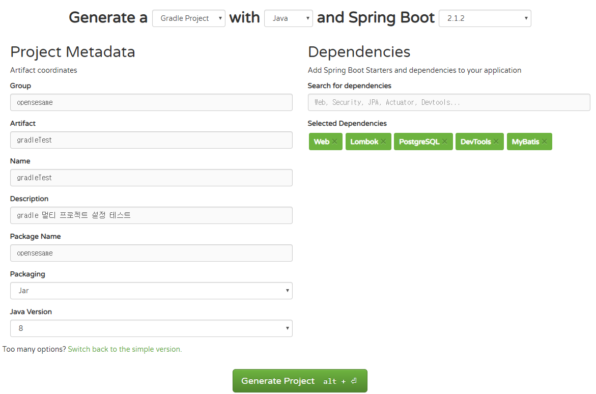

## 1. spring.io에서 springboot 프로젝트 생성하기

- 이클립스에서 바로 할 수 있지만 난 초짜이므로 일단 SpringIO를 통해서 프로젝트를 생성.
- [SpringIO](http://spring.io/)에서 SpringBoot 프로젝트를 생성한다.
- 상단탭에서 PROJECTS - SPRING BOOT선택 - Quick start의 Spring Initializr 링크 선택
- 또는 url로 바로 Initializr경로[(https://start.spring.io/)](https://start.spring.io/)로 이동 가능하다.
- Switch To the full version링크를 선택하여 다른 옵션들을 활성화한다.

- Group : 그룹명
- Artifact : 실제 생성되는 프로젝트명
- Name : 이건 그냥 Artifact랑 동일하게 써줬다.
- Package Nmae : 처음 생성되는 패키지 명으로 Group.Artifact로 자동완성된다. 패키지명이 길어지는게 싫어서
  Artifact는 지워버리고 group명과 동일하게 하여 기본 패키지명으로 사용하였다.
- Dependencies : 프로젝트에 필요한 의존성을 추가. Web, Lombok, PostgreSQL, DevTools, Mybatis를 추가하였고 필요에 따라 Spring Security도 추가.
- Generate Project 버튼을 선택하여 설정한 프로젝트를 다운로드한다.
- 이렇게 멀티로 설정할 프로젝트들을 만들고 다운로드 하여 하나의 폴더에 넣는다.

## 2. gradle 설정

- 사용하고자 하는 gradle 버전을 다운로드 한다.
- 프로젝트에 따라 사용하는 버전이 다를 수 있으므로 gradle 폴더를 만들고 그 하위에 버전별로 gradle을 두고 쓰는게 편하다.
- 사용할 gradle 버전의 경로만 환경 변수에 추가하여 사용한다.
- cmd 창에서  gradle -v를 해서 버전 정보가 나온다면 정상적으로 패쓰에 등록된 것이다.
- 이제 위에서 멀티 프로젝트들은 담은 폴더를 cmd를 통해서 접근한다.
- 해당 폴더에서 [gradle init] 명령어를 입력하고 기본정보들을 입력 또는 엔터 쳐서 넘기고 나면 기본적인 gradle 설정 파일들이 생성된다.

## 3. 프로젝트 설정

- 루트 폴더의 settings.gradle 파일에 프로젝트들관의 관계를 설정해준다.
~~~ properties
  rootProject.name = "gradleSample"
  include ":test-admin"
  include ":test-user"

  project(":test-admin").projectDir = "$rootDir/test-admin" as File
  project(":test-user").projectDir = "$rootDir/test-user" as File
~~~

## 4. import

- 기본적이 설정이 끝났으면 개발을 하기 위해 이클립스에서 import 한다.
- gradle project import 를 선택하고 위에서 설정한 폴더를 선택하고 import한다.

## 5. 프로젝트별 공유

- A 프로젝트에서 B프로젝트에 있는 클래스를 사용하기 위해서는 설정을 해주어야 한다.
- A 프로젝트의 build.gradle 파일의 dependencies에 implementation project(":해당프로젝트명")
- **다른 프로젝트를 import 하게 되면 테스트 코드를 작성할 때 오류가 발생하는데 테스트 코드에 클래스를 명시해 주어야 한다.**
~~~ java
  @RunWith(SpringRunner.class)
  @SpringBootTest(classes = TestAdmin.class)
  public class QueryExcuteTests {
      @Test
      public void testCode(){

      }
  }
~~~

## 6. build

- 이클립스의 마켓에서 gradle 관련 플러그인을 설치하고 해당 플러그인을 통해 gradle 빌드를 한다.
- 또는 cmd창에서 gradle 명령어로 할 수 도 있다.
- gradle 프로젝트의 루트 폴더에서 build를 하면 기본적인 설정 끝.

