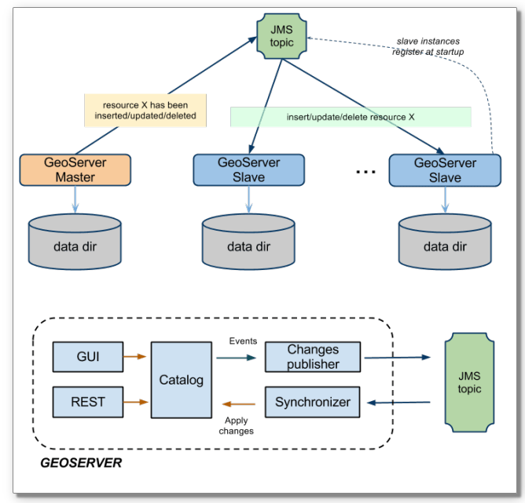
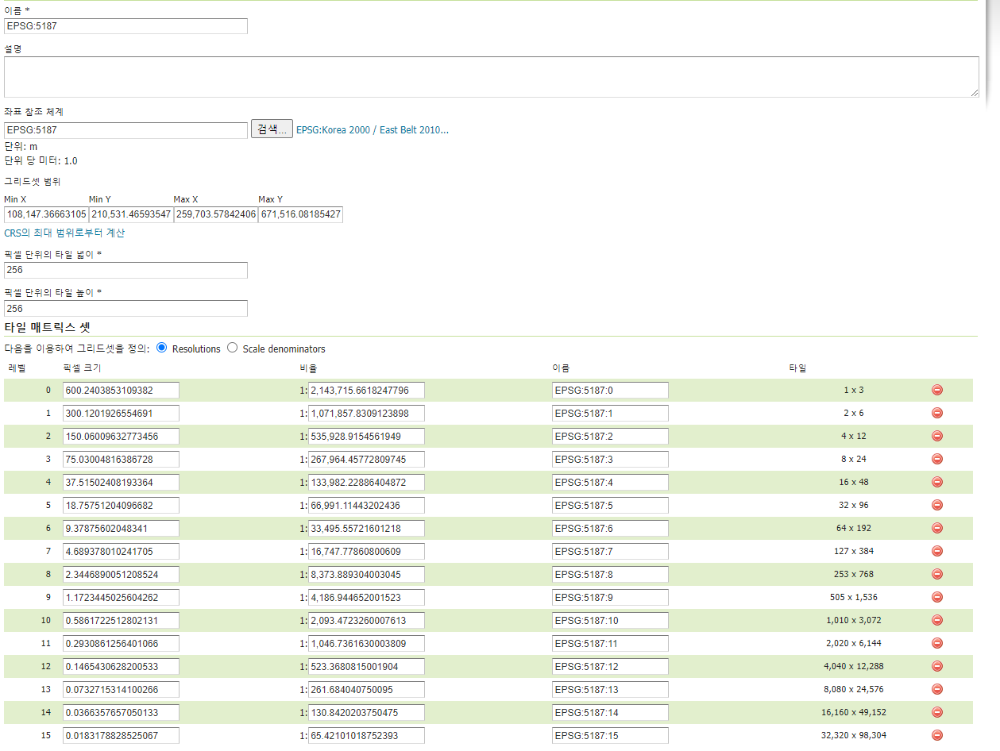
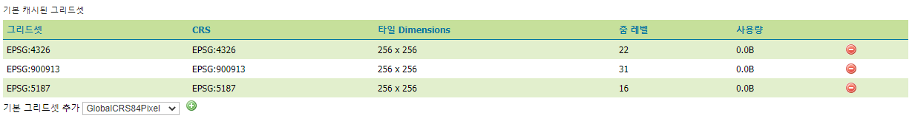
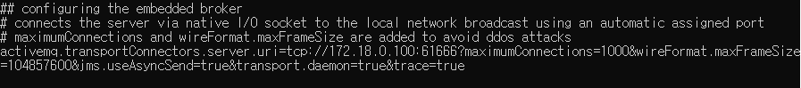

### 1. jms 클러스터링 구성

### 2. geoserver 기본 설정
- docker container 생성 및 시작
~~~ shell
    cmd> docker network create --subnet=172.18.0.0/16 mynetwork
    cmd> docker container run --privileged  -d --net mynetwork --ip 172.18.0.100 -p 18888:8080 -v "D:\geoserver\gwc-data":"/home/gaia3d/gwc-data" -v "D:\geoserver\map-data":"/home/gaia3d/map-data" --name "geoserver1" gaia3d/geoserver /sbin/init
    cmd> docker container run --privileged  -d --net mynetwork --ip 172.18.0.200 -p 28888:8080 -v "D:\geoserver\gwc-data":"/home/gaia3d/gwc-data" -v "D:\geoserver\map-data":"/home/gaia3d/map-data" --name "geoserver2" gaia3d/geoserver /sbin/init
~~~
- geoserver data 는 독립적으로 사용하고 tiff 파일과 캐시 데이터는 공유 디렉토리를 마운트해서 사용한다.
- **타일 캐시와 관련된 설정은 동기화 되지 않으며, gwc data 디렉토리를 공유해서 사용할 경우 master 의 변경 사항은 slave 에서 reload 후에 적용 된다.**
- geoserver applictaion 배치 및 서비스 시작(geoserver1, geoserver2 동일하게 실행)
~~~ shell
    su gaia3d
    mkdir /home/gaia3d/tools/geoserver-tomcat/webapps/geoserver
    unzip /home/gaia3d/setup/geoserver.war -d /home/gaia3d/tools/geoserver-tomcat/webapps/geoserver
    cp /home/gaia3d/setup/geoserver-2.16-SNAPSHOT-jms-cluster-plugin/* /home/gaia3d/tools/geoserver-tomcat/webapps/geoserver/WEB-INF/lib/
    sudo systemctl restart geoserver-tomcat
~~~
- 타일 캐시 - 그리드셋 - 새로운 그리드셋 생성

- geoserver2 설정 reload
- 타일 캐시 - 캐시 기본 설정 - 기본 그리드셋 추가(geoserver1, geoserver2 동일하게 설정)

### 3. cluster 설정
- jms cluster plugin 이 설치 되면 기본적으로 embeddedBroker 가 활성화 된다. 여기서는 master 의 broker 만 활성화 하고 slave 는 master 의 변경사항만 전달 받도록 설정한다.
- master
    - embedded-broker.properties
    
    - cluster.properties
    ~~~ properties
        #
        #Sat Jun 13 09:32:53 UTC 2020
        CLUSTER_CONFIG_DIR=/home/gaia3d/geoserver-data/cluster
        instanceName=master-geoserver
        readOnly=disabled
        durable=true
        brokerURL=
        embeddedBroker=enabled
        connection.retry=10
        toggleMaster=true
        xbeanURL=./broker.xml
        embeddedBrokerProperties=embedded-broker.properties
        topicName=VirtualTopic.geoserver
        connection=enabled
        toggleSlave=false
        connection.maxwait=500
        group=geoserver-cluster
    ~~~

- slave
    - cluster.properties
    ~~~ properties
        #
        #Sat Jun 13 09:32:53 UTC 2020
        CLUSTER_CONFIG_DIR=/home/gaia3d/geoserver-data/cluster
        instanceName=slave-geoserver
        readOnly=disabled
        durable=true
        brokerURL=tcp://172.18.0.100:61666
        embeddedBroker=disabled
        connection.retry=10
        toggleMaster=false
        xbeanURL=./broker.xml
        embeddedBrokerProperties=embedded-broker.properties
        topicName=VirtualTopic.geoserver
        connection=enabled
        toggleSlave=true
        connection.maxwait=500
        group=geoserver-cluster
    ~~~

