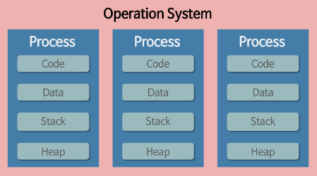
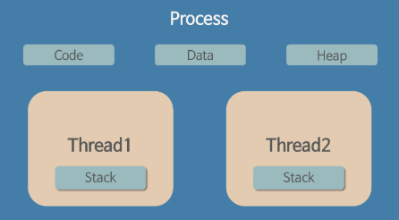

## whiteship/live-study 10주차 정리
- 목표
    - [자바의 멀티쓰레드 프로그래밍에 대해 학습하세요.](https://github.com/whiteship/live-study/issues/10)
- 학습할 것 (필수)
    - Thread 클래스와 Runnable 인터페이스
    - 쓰레드의 상태
    - 쓰레드의 우선순위
    - Main 쓰레드
    - 동기화
    - 데드락

 

### 1. Thread 클래스와 Runnable 인터페이스
- process & thread
    - process
        - 컴퓨터에서 연속적으로 실행되고 있는 컴퓨터 프로그램
        - 메모리에 올라와 독립적으로 실행되고 있는 프로그램의 인스턴스
        - 각각의 프로세스가 운영체제로부터 CPU 자원, 독립된 메모리 영역등을 할당 받는다.
        
    - thread
        - process 내에서 실행되는 여러 흐름의 단위
        - process 가 할당받은 자원을 이용하는 실행의 단위
        - thread 는 프로세스 내에서 각각 stack 만 따로 할당받고 code, data, heap 영역을 공유한다.
        
- thread 를 생성하는 방법에는 Runnable 인터페이스를 사용하거나 Thread 클래스를 사용하는 두 가지 방법이 있다.
- Thread 를 상속 받으면, 다른 클래스를 상속받을 수 없기 때문에 인터페이스를 구현하는 방법이 더 일반적이다.
    - Runnable 인터페이스
    ~~~ java
      public class HelloRunnable implements Runnable {
          public static void main(String[] args) {
              (new Thread(new HelloRunnable())).start();
          }

          @Override
          public void run() {
              System.out.println("Hello from a thread!");
          }
      }
    ~~~
    - Thread 클래스
    ~~~ java
      public class HelloThread extends Thread {
          public static void main(String[] args) {
              (new HelloThread()).start();
          }

          @Override
          public void run() {
              System.out.println("Hello from a thread!");
          }
      }
    ~~~
- sleep()
    - Thread.sleep 메소드는 쓰레드가 지정된 기간 동안 실행을 일시 중단하도록 한다.
    - sleep 메소드는 두 가지 오버로드 된 메소드를 제공하며, 하나는 밀리초로, 다른 하나는 나노초로 중단 시간을 지정한다.
    ~~~ java
      public class SleepMessages {
          public static void main(String[] args) throws InterruptedException {
              String[] importantInfo = {
                      "Mares eat oats",
                      "Does eat oats",
                      "Little lambs eat ivy",
                      "A kid will eat ivy too"
              };

              for (String s : importantInfo) {
                  //Pause for 4 seconds
                  Thread.sleep(4000);
                  //Print a message
                  System.out.println(s);
              }
          }
      }
    ~~~
- interrupt()
    - 현재 수행중인 쓰레드를 중단시킨다.
    - 그냥 중지 시키지 않고 InterruptedException 예외를 발생시키면서 중단시킨다.
- join()
    - 일정 시간 동안 특정 쓰레드가 작업하는 것을 기다리게 만든다.
       

### 2. 쓰레드의 상태
- Thread.start() 메소드를 호출하면 곧바로 쓰레드가 실행되는 것처럼 보이지만 사실은 대기 상태가 된다.
- 쓰레드 스케줄링으로 선택된 쓰레드가 비로서 CPU 를 점유하고 run() 메소드를 실행한다.

- |상태|열거 상수|설명|
|:--|:--|:--|
|객체 생성|NEW|쓰레드 객체가 생성, 아직 start() 메소드가 호출되지 않음|
|실행 대기|RUNNABLE|실행 상태로 언제든지 갈 수 있는 상태|
|일시 정지|WAITING|다른 쓰레드가 통지할 때까지 기다리는 상태|
|일시 정지|TIMED_WAITING|주어진 시간동안 기다리는 상태|
|일시 정지|BLOCKED|사용하고자 하는 객체의 락이 풀릴 때까지 기다리는 상태|
|종료|TERMINATED|실행을 마친 상태|

 

### 3. 쓰레드의 우선순위
- 쓰레드마다 우선순위(Priority)를 다르게 설정할 수 있고, 시스템이 busy 할 때 우선순위가 높은 쓰레드에게 먼저 CPU 를 할당해 준다.
- 우선 순위는 1부터 10 까지의 숫자로 설정할 수 있으며, 다음 3개의 static 변수를 제공한다.
~~~ java
  public final static int MIN_PRIORITY = 1;
  public final static int NORM_PRIORITY = 5;
  public final static int MAX_PRIORITY = 10;
~~~
- 쓰레드를 생성하면 기본적으로 우선순위는 5로 설정되어 있다. 어떤 쓰레드가 5보다 큰 우선순위를 갖고 있다면, 시스템은 우선순위가 5인 쓰레드보다 더 우선하여 스케줄링 해준다.
- setPriority(), getPriority()
    - 쓰레드에 우선순위를 설정할 때는 setPriority() 를, 설정된 값을 확인할 때는 getPriority() 를 사용한다.

 

### 4. Main 쓰레드
- 메인 쓰레드는 프로그램이 시작하면 가장 먼저 실행되는 쓰레드이며, 모든 쓰레드는 메인 쓰레드로부터 생성된다.
- 다른 쓰레드를 생성해서 실행하지 않으면, 즉 메인 쓰레드가 종료되는 순간 프로그램도 종료 된다.
- 만약 여러 쓰레드를 실행하면, 메인 쓰레드가 종료되어도 다른 쓰레드가 작업을 마칠 때까지 프로그램이 종료되지 않는다.

 

### 5. 동기화
- 쓰레드는 주로 필드 및 개체 참조 필드에 대한 액세스를 공유하여 통신한다. 이러한 형태의 통신은 매우 효율적이지만 쓰레드 간섭 및 메모리 일관성 오류가 발생할 여지가 있다.
  이러한 오류를 방지하기 위한 동기화 방법으로는 다음과 같은 것들이 있다.
- Synchronized Methods
    - 동기화 할 메소드에 **synchronized** 키워드를 추가한다.
    - 생성자는 동기화 할 수 없다.
    ~~~ java
      public class SynchronizedCounter {
          private int c = 0;

          public synchronized void increment() {
              c++;
          }

          public synchronized void decrement() {
              c--;
          }

          public synchronized int value() {
              return c;
          }
      }
    ~~~
    - 위와 같은 클래스에서 메소드에 synchronized 키워드를 사용하여 동기화하면 두 가지 효과가 있다.
        - 동일한 개체에서 동기화 된 메서드를 두 번 호출하면 끼어들 수 없다. 한 쓰레드가 개체에 대해 동기화 된 메소드를 실행 때 첫 번째 쓰레드가 개체에 대한 작업을 완료 할 때까지 동기화 된 메소드를 호출하는
    다른 모든 쓰레드는 실행이 일시 중지 된다.
        - 동기화 된 메소드가 종료되면 동일한 개체에 대해 동기화된 메소드는 후속 호출과 발생 전 관계를 자동으로 설정한다. 이렇게 하면 개체 상태에 대한 변경 내용이 모든 쓰레드에 표시된다.
- Atomic Access
    - 변수에 **volatile** 키워드를 사용한다.
    - volatile 키워드는 자바 변수를 메인 메모리에 저장하겠다라는 것을 명시하는 것으로, 변수의 값을 읽을때마다 CPU cache 에 저장된 값이 아닌 메인 메모리에서 읽는다.
    - cache 를 타지 않고 바로 메인 메모리의 값을 읽기 때문에 여러 쓰레드에서 접근하더라도 메모리 일관성 오류의 위험이 줄어든다.

 

### 6. 데드락
- Deadlock(교착상태)란, 둘 이상의 쓰레드가 lock 을 획득하기 위해 대기하는데, 이 lock 을 잡고 있는 쓰레드들도 똑같이 다른 lock 을 기다리면서 서로 block 상태에 놓이는 것을 말한다.
- 데드락은 다수의 쓰레드가 같은 lock 을 동시에, 다른 명령에 의해 획득하려 할 때 발생할 수 있다.
~~~ java
  public class Deadlock {
      public static void main(String[] args) {
          final Friend alphonse = new Friend("Alphonse");
          final Friend gaston = new Friend("Gaston");
          new Thread(() -> alphonse.bow(gaston)).start();
          new Thread(() -> gaston.bow(alphonse)).start();
      }

      static class Friend {
          private final String name;

          public Friend(String name) {
              this.name = name;
          }

          public String getName() {
              return this.name;
          }

          public synchronized void bow(Friend bower) {
              System.out.format("%s: %s has bowed to me!%n", this.name, bower.getName());
              bower.bowBack(this);
          }

          public synchronized void bowBack(Friend bower) {
              System.out.format("%s: %s has bowed back to me!%n", this.name, bower.getName());
          }
      }
  }
~~~
 

#### 참조 링크
- [https://docs.oracle.com/javase/tutorial/essential/concurrency/index.html](https://docs.oracle.com/javase/tutorial/essential/concurrency/index.html)
- [https://sujl95.tistory.com/63](https://sujl95.tistory.com/63)
