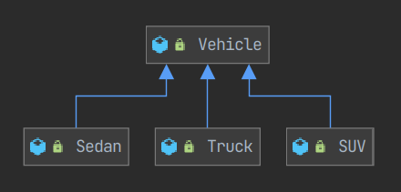
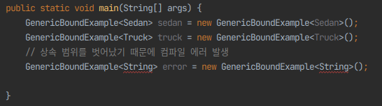

## whiteship/live-study 14주차 정리
- 목표
    - [자바의 제네릭에 대해 학습하세요.](https://github.com/whiteship/live-study/issues/14)
- 학습할 것 (필수)
    - 제네릭 사용법
    - 제네릭 주요 개념 (바운디드 타입, 와일드 카드)
    - 제네릭 메소드 만들기
    - Erasure

 

### 1. 제네릭 사용법
- 제네릭 기본 이해
    - 제네릭은 자바 5 에서 추가된 기능으로, **클래스나 메소드에서 사용할 데이터 타입을 컴파일시에 미리 지정하는 방법이다.**
    - 제네릭을 사용하면 코드의 품질이나 가독성이 높아진다. 아래의 두 코드를 비교해 보면 제네릭을 사용하면 특별히 주석에 명시하지 않아도 데이터가 String 을 포함한다는 것을 바로 알 수 있지만
    그다음 줄의 List 객체는 제네릭을 사용하지 않았기 때문에 선언만으로는 확인이 불가능하고 소스 코드 전체를 확인해 봐야 사용하는 데이터 유형을 알 수 있다.
    ~~~ java
    List<String> nameList = new ArrayList<>();
    List nameList = new ArrayList();
    ~~~
- 제네릭을 사용하면 얻을 수 있는 장점
    - 사용하고자 하는 데이터 타입을 명확히 선언할 수 있다.
    - **정확한 데이터를 사용했는지 여부를 컴파일하는 시점에 확인할 수 있다.**
    - 클래스 캐스트가 필요 없기 때문에 불필요한 소스 코드를 줄일 수 있다.
    - 객체 선언 시 명확한 데이터를 지정할 수 있기 때문에 소스 코드의 가독성을 높일 수 있다.
- 제네릭 사용법
    - 제네릭 타입은 **<>** 구문 안에 원하는 개수만큼 ',' 로 구분해서 기술하면 되는데 만일 클래스가 상속 관계에 있다면 상속 클래스에도 제네릭으로 선언할 수 있다.터
    - ClassName 다음에 있는 '<>' 부분은 자바 언어 스펙에서의 공식 용어는 **타입 파라미터(Type Parameter)** 이다.
    ~~~ java
    class ClassName<Type1, Type2, Type3 ... TypeN> { }
    ~~~
    ~~~ java
    class ClassName<Type1, Type2, Type3 ... TypeN> extends SuperClass<Type1, Type2 ... TypeN> { }
    ~~~
- 제네릭 타입 파라미터 규칙
    - 자바의 파일면은 제네릭을 제외하고 만든다. 예를 들어 코드가 MyList\<A> 라면 파일명은 MyList.java 이다.
    - 같은 패키지안에 클래스명은 같고 제네릭명은 다르게 선언할 수 없다. 즉, **제네릭은 어디까지나 보조적인 정보이지 클래스명을 결정하는 구성 요소는 아니다.**
    - 제네릭 표현식 안의 문자는 자바의 변수 선언과 동일하다. 숫자여서는 안되고 숫자로 시작해서도 안되며, 특수 문자 중 '_'를 제외하고 처음 시작 문자로 사용할 수 없고 유니코드 문자를 지원한다.
    - 통상적으로 대문자 영문 한 글자를 쓰는 게 관례이다.
    - 객체의 생성과 선언 시 타입 파라미터는 동일해야 한다. 예를 들어 MyList<String> myList = new MyList<Integer>(); 같은 형태의 선언은 컴파일 에러가 발생한다.
- 제네릭과 관련 타입 파라미터명에 대한 관습적인 정의
    - **E**: Elements 를 뜻한다. 주로 컬렉션 프레임워크 같은 목록성 데이터를 관리하는 클래스의 제네릭 타입을 정의할 때 사용한다.
    - **K**: Key 를 뜻한다. 이름과 값으루 구성된 데이터(예: HashTable, HashMap 등)를 관리하는 클래스에서 사용한다.
    - **V**: Value 를 뜻한다. K 와 함께 조합해서 이름과 값으로 구성된 데이터를 관리하는 클래스에 사용한다. 주로 <K, V> 와 같은 형태로 정의한다.
    - **T**: 타입을 뜻한다. 주로 VO 나 엔티티형 클래스에서 원하는 데이터 타입을 제네릭 형태로 선언하고 싶을 때 사용한다.
    - **N**: Number 를 뜻한다.
    - **R**: Return 을 뜻한다. 메서드의 리턴 타입을 지정하고 싶을 때 사용한다.

 

### 2. 제네릭 클래스/메소드 만들기
- 제네릭 클래스와 로우 타입
    - 아래의 제네릭 적용전 코드에서 List list = new ArrayList() 라고 선언하였는데, List 인터페이스와 ArrayList 클래스는 제네릭으로 설계된 컬렉션 프레임워크의 핵심 기능중 하나이지만
      제네릭 타입으로 선언하지 않았다. 이렇게 제네릭으로 설계된 클래스임에도 불구하고 제네릭을 사용하지 않고 선언한 객체를  **로우 타입**(Raw Type)이라고 한다.
    - **로우 타입은 제네릭이 도입 되기 이전 코드와의 호환성을 위해 제공될 뿐이며, 런타임에 예외가 발생할 수 있기 때문에 사용하면 안된다.**
    - 제네릭 적용 전
      ~~~ java
      public class CustomList {
          private final List list = new ArrayList();

          public void add(Object element) {
              list.add(element);
          }

          public Object get(int index) {
              return list.get(index);
          }
      }
      ~~~
    - 제네릭 적용
      ~~~ java
      public class GenericCustomList<E> {

          private final List<E> list = new ArrayList<E>();

          public void add(E element) {
              list.add(element);
          }

          public E get(int index) {
              return list.get(index);
          }
      }
      ~~~
- 멀티 타입 파라미터 클래스
  ~~~ java
  public class GenericCustomMap<K, V> {

      private final Map<K, V> map = new HashMap<K, V>();

      public void put(K key, V value) {
          map.put(key, value);
      }

      public V get(K key) {
          return map.get(key);
      }
  }
  ~~~
- 제네릭 메소드
    - 제네렉 메소드 설계 시 고려해야 할점
        - 제네릭 메서드에서 선언한 타입의 범위는 메서드 내부로 제한된다.
        - 일반 메서드뿐만 아니라 정적 메서드에서도 제네릭을 사용할 수 있다.
        - **정적 메서드를 정의할 때 리턴 값을 기술하기 전에 반드시 제네릭 타입 파라미터를 먼저 선언해야 한다.** 왜냐하면 제네릭에서 K 와 V 값은 객체를 생성하면서 결정하는데 정적 메서드는
        객체화하지 않고 호출하는 메서드이기 때문이다.
        - 제네릭 메서드도 제네릭 클래스와 마찬가지로 호출할 때 제네릭 타입을 생략할 수 있다.
    - 제네릭 메서드 만들기
      ~~~ java
      public void put(K key, V value) {
          map.put(key, value);
      }

      public V get(K key) {
          return map.get(key);
      }
      ~~~
    - 스태틱 제네릭 메서드 만들기
    ~~~ java
      public class GenericUtil {
          public static <K, V> Map<K, V> sorting(Map<K, V> map) {
              return map;
          }
      }
    ~~~
    ~~~ java
      Map<String, String> prop = new HashMap<String, String>();
      // 스태틱 제네릭 메소드 호출 예제(호출할 때 타입은 생략 가능)
      Map<String, String> sortedProp = GenericUtil.<String, String>sorting(prop);
    ~~~

 

### 3. Erasure
- 제네릭 타입을 사용한 자바 클래스
~~~ java
public class GenericErasureExample {

    public static void main(String[] args) {
        List<String> myList = new ArrayList<String>();
        myList.add("Hello");
        myList.add("World");

        String hello = myList.get(0);
        String world = myList.get(1);

        System.out.println(hello + " " + world);
    }
}
~~~
- 디컴파일 결과
~~~ java
public class GenericErasureExample {
    public GenericErasureExample() {
    }

    public static void main(String[] args) {
        List<String> myList = new ArrayList();
        myList.add("Hello");
        myList.add("World");
        String hello = (String)myList.get(0);
        String world = (String)myList.get(1);
        System.out.println(hello + " " + world);
    }
}
~~~
- 원래 작성한 자바 파일과 디컴파일한 코드를 잘 비교해 보면 제네릭 타입 선언 등의 내용이 삭제되고 변환된 것을 볼 수 있다. 이를 **제네릭 삭제**(Generic Erasure) 라고 한다.
- 자바 5에서 제네릭 삭제 개념이 적용된 것은 하위 버전 호환성 때문이다.
- 위의 코드의 다른 부분을 보면 다음과 같다.
  ~~~ java
  List<String> myList = new ArrayList<String>(); // 코딩 내용
  ArrayList myList = new ArrayList(); // 디컴파일 결과
  ~~~
- 변수명은 동일하지만 제네릭 타입 파라미터는 제거되었다. **타입 파라미터는 컴파일러에 의해 해석되는 부분이고 자바 가상 머신에서는 해석이 되지 않기 때문이다.** 그래서 제네릭은 런타임에
체크하는 것이 아니라 컴파일 시에 정합성을 체크하게 된다.
- 위의 비교로 알 수 있는 제네릭 관련 원칙
    - 제네릭은 컴파일 시에 해석되고 바이트 코드로 변환될 때는 제거된다. 즉, 자바 가상 머신은 제네릭을 고려하지 않고 실행되며 제네릭이 제거된 기본 클래스형으로만 처리한다.
    - 클래스 선언 시 사용된 제네렉 타입은 제거되며 메서드에서 리턴 받을 때는 컴파일러에 의해 형 변환된 코드가 자동 추가 된다.
- **자바 가상 머신상에서 제네릭 코드를 제거하는 이유는 제네릭을 해석하기 위한 추가적인 자원 소모를 없애고 자바 가상 머신이 빠르게, 그리고 명확하게 동작하도록 하기 위해서다.**

 

### 4. 제네릭 주요 개념 (바운디드 타입, 와일드 카드)
- 와일드 카드(Wildcard)
    - 와일드카드란 카드 게임에서 유래된 용어로 카드 플레이어가 자기 맘대로 사용할 수 있는 만능 카드를 의미한다. 컴퓨터 용어에서는 이보다 좀 더 확장된 개념으로 사용하는데 주로
    패턴을 정의할 때 많이 사용하며 '전체' 의 의미로 쓰이거나 특정 문자에 따라 조건이 지정된다는 뜻으로 쓰인다.
    - 주로 잘 알려진 와일드카드는 '?' 와 '*' 인데 제네릭에서는 '?' 만 와일드카드로 사용할 수 있다.
- **와일드카드에서 특정 타입으로 제한하는 것을 바운드 타입 파라미터**라고 하며 두 가지 접근 방법을 선택 할 수 있다.
    - 다음과 같이 엔티티 클래스의 상속 관계를 설계 했다고 하였을 때 각각 extends 와 super 를 이용하여 바운드 타입 파라미터를 지정 할 수있다.
    
    - extends 를 이용한 제한
      ~~~ java
      public class GenericBoundExample<T extends Vehicle> {
          private T vehicleType;

          public void setVehicleType(T vehicleType) {
              this.vehicleType = vehicleType;
          }

          public T getVehicleType() {
              return vehicleType;
          }
      }
      ~~~
    
    - super 를 이용한 제한
        - 지정한 클래스나 인터페이스의 상위 클래스 혹은 인터페이스를 허용하겠다는 것이다.
        - 위의 엔티티 클래스들의 상속 관계에서 타입을 Truck 으로 지정하였다면 사용할 수 있는 타입은 Truck, Vehicle 그리고 Object 클래스이다.
- extends VS super
    - 소프트웨어에 대한 요구 사항이나 환경, 개발자의 성향에 따라 달라질 수 있지만 일반적인 선택 기준은 다음과 같다.
        - 제네릭 메서드에서 입력 파라미터의 경우 extends 와일드카드를 이용하는 것이 좋다.
        - 제네릭 메서드에서 출력 파라미터의 경우 super 와일드카드를 이용하는 것이 좋다.
        - **입력은 데이터를 생성하는 주체이고 출력은 데이터를 소비하는 주체이다.
          그래서 생성과 관련된 것은 extends, 소비와 관련된 것은 super 를 사용한다고 정의하기도 한다.** *--이펙티브 자바. 아이템 31- 한정적 와일드카드를 사용해 API 유연성을 높이라.--*

 

### 5. 제네릭 제약 조건
- 제네릭의 타입은 자바의 기본형을 사용할 수 없다.
- 제네릭 코딩은 컴파일 시에만 사용된다.
- 제네릭 타입으로 정의한 배열은 생성할 수 없다.
    - 변수 선언은 가능하지만 생성은 불가능하며 컴파일 에러가 발생한다.
- 제네릭의 타입 변수로 객체를 생성할 수 없다.
    - 타입 변수로 많이 사용하는 T, K, V, E 등으로 클래스 내부에서 객체를 생성할 수 없다.
- 제네릭 타입 변수는 정적 필드 혹은 메서드에서 사용할 수 없다.
    - 정적 필드의 경우 클래스가 로딩되면서 생성되고, 싱글턴 형태로 계속 메모리에 남아서 재사용되는데 이를 제네릭 타입으로 특정할 수 없기 때문이다.
- 제네릭 클래스를 catch 하거나 throw 할 수 없다. catch 절에서는 타입 변수가 아닌 예외 클래스를 직접 명시해야만 한다.

 

### 6. 다이아몬드 연산자
- 자바 7 부터 도입 되었으며, 객체 선언부에 <> 를 기술하면 변수 선언 시에 사용한 제네릭 타입이 그대로 적용된다.
~~~ java
Map<String, List<String>> myMap = new HashMap<>();
~~~
- **다이아몬드 연산자는 오직 객체를 생성하는 부분에서만 사용할 수 있다.**
~~~ java
Map<> myMap = new HashMap<String, List<String>>(); // 컴파일 에러 발생
~~~
- 위의 코드에서 컴파일 에러가 발생하는 이유는 **컴파일러가 제네릭의 타입을 추정할 때 변수에 선언해 놓은 파라미터를 바탕으로 추정하기 때문이다.**
- 자바 10 부터는 변수를 선언 할 때 특정한 클래스를 지정하지 않고 타입 추론이 가능하도록 **var** 를 사용할 수 있으며, 다음과 같이 코드의 양을 줄일 수 있다.
~~~ java
var myMap = new HashMap<String, List<String>>();
~~~

 

#### 참조
- Practical 모던 자바 *-인사이트-*
