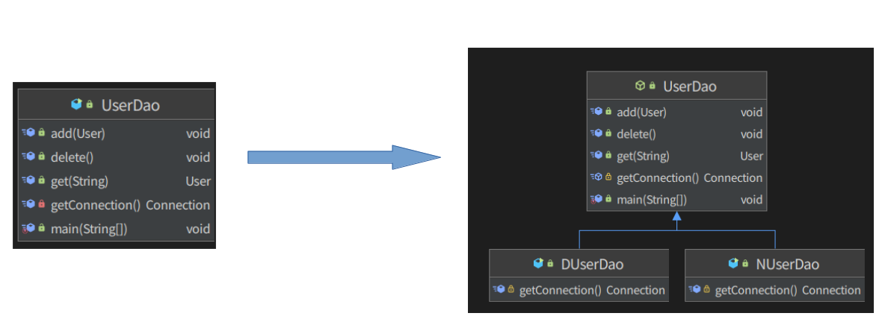
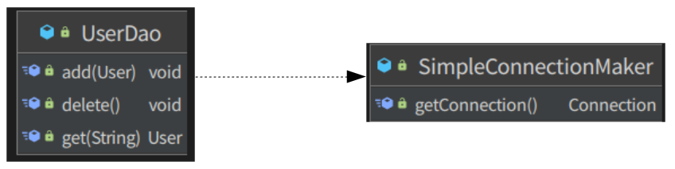
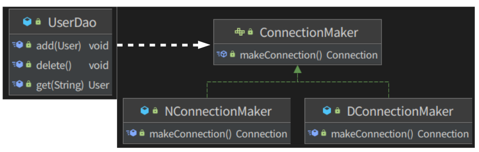
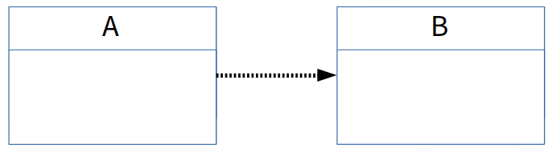

- 토비의 스프링 1장을 보고 최신 스프링버전에서 테스트 해보고 정리한 내용.
- [예제 소스](https://github.com/bingbingpa/dev-book/blob/master/toby-spring)

### 1.1 초난감 DAO
- DAO(Data Access Object) 는 DB 를 사용해 데이터를 조회하거나 조작하는 기능을 전담하도록 만든 오브젝트를 말한다.
- 책에서는 mysql-connector jar 파일을 클래스패스에 넣어주게 되어 있지만 테스트한 소스에는 gradle 기반에 mysql-connector8.x 버전의 의존성을 추가 했다.
- JDBC 를 이용한 등록과 조회 기능이 있는 날 것 그대로의 UserDao 클래스를 만든다.
~~~ java
  public class UserDao {
      public void add(User user) throws ClassNotFoundException, SQLException {
          Class.forName("com.mysql.cj.jdbc.Driver");
          Connection c = DriverManager.getConnection("jdbc:mysql://localhost:13306/springbook?characterEncoding=UTF-8", "spring", "book");

          PreparedStatement ps = c.prepareStatement("insert into users(id, name, password) values(?,?,?)");
          ps.setString(1, user.getId());
          ps.setString(2, user.getName());
          ps.setString(3, user.getPassword());

          ps.executeUpdate();

          ps.close();
          c.close();
      }

      public User get(String id) throws ClassNotFoundException, SQLException {
          Class.forName("com.mysql.cj.jdbc.Driver");
          Connection c = DriverManager.getConnection("jdbc:mysql://localhost:13306/springbook?characterEncoding=UTF-8", "spring", "book");
          ....
      }
  }
~~~

 

### 1.2 DAO 의 분리
- **관심사의 분리(Separation of Concerns)**: 관심이 같은 것끼리는 하나의 객체 안으로 또는 친한 객체로 모이게 하고, **관심이 다른 것은 가능한 한 따로 떨어져서 서로 영향을 주지 않도록 분리하는 것.**
- UserDao 의 관심 사항
    - DB 와 연결을 위한 커텍션을 어떻게 가져올것인가.
    - 사용자 등록을 위해 DB 에 보낼 SQL 문장을 담을 Statement 를 만들고 실행.
    - 작업이 끝나면 사용한 리소스인 Statement 와 Connection 의 리소스 해제.
- **하나의 관심사가 방만하게 중복되어 있고, 여기저기 흩어져 있어서 다른 관심의 대상과 얽혀 있으면, 변경이 일어날 때 엄청난 고통을 일으키는 원인이 된다.**
- 중복 코드의 메소드 추출하기
    - DB 연결과 관련된 부분에 변경이 일어났을 경우 getConnection() 이라는 한 메소드의 코드만 수정하면 되도록 변경됐다.
    - 관심의 종류에 따라 코드를 구분해 놓았기 때문에 한 가지 관심에 대한 변경이 일어날 경우 그 관심이 집중되는 부분의 코드만 수정하면 된다. **관심이 다른 코드가 있는 메소드에는 영향을 주지도 않을뿐더러, 관심 내용이 독립적으로 존재하므로 수정도 간단해졌다.**
    ~~~ java
      public void add(User user) throws ClassNotFoundException, SQLException {
          Connection c = getConnection();
          ...
      }

      public User get(String id) throws ClassNotFoundException, SQLException {
          Connection c = getConnection();
          ...
      }

      private Connection getConnection() throws ClassNotFoundException, SQLException {
          Class.forName("com.mysql.cj.jdbc.Driver");
          Connection c = DriverManager.getConnection("jdbc:mysql://localhost:13306/springbook?characterEncoding=UTF-8", "spring", "book");
          return c;
      }
    ~~~
- 상속을 통한 확장
    - UserDao 에서 메소드의 구현 코드를 제거하고 getConnection() 을 추상 메소드로 만들어 놓는다. 추상 메소드라서 메소드 코드는 없지만 메소드 자체는 존재한다.
    - 이렇게 하면 UserDao 의 소스코드를 수정하지 않아도 getConnection() 메소드를 원하는 방식으로 확장한 후에 UserDao 의 기능과 함께 사용할 수 있다.
    - 기존에는 같은 클래스에 다른 메소드로 분리됐던 DB 커넥션 연결이라는 관심을 이번에는 상속을 통해 서브클래스로 분리했다.
    - **클래스 계층 구조를 통해 두 개의 관심이 독립적으로 분리되면서 변경 작업은 한층 용이해졌다.**
    
    ~~~ java
      public abstract class UserDao {
          public void add(User user) throws ClassNotFoundException, SQLException {
              Connection c = getConnection();

              PreparedStatement ps = c.prepareStatement("insert into users(id, name, password) values(?,?,?)");
              ps.setString(1, user.getId());
              ps.setString(2, user.getName());
              ps.setString(3, user.getPassword());

              ps.executeUpdate();

              ps.close();
              c.close();
          }

          public User get(String id) throws ClassNotFoundException, SQLException {
             ....
          }

          abstract protected Connection getConnection() throws ClassNotFoundException, SQLException;

      }
    ~~~
    ~~~ java
      public class DUserDao extends UserDao {
          protected Connection getConnection() throws ClassNotFoundException, SQLException {
              Class.forName("com.mysql.cj.jdbc.Driver");
              Connection c = DriverManager.getConnection("jdbc:mysql://localhost:13306/springbook?characterEncoding=UTF-8", "spring", "book");
              return c;
          }
      }
      public class NUserDao extends UserDao {
          protected Connection getConnection() throws ClassNotFoundException, SQLException {
              Class.forName("com.mysql.cj.jdbc.Driver");
              Connection c = DriverManager.getConnection("jdbc:mysql://localhost:13306/springbook?characterEncoding=UTF-8", "spring", "book");
              return c;
          }
      }
    ~~~
    ~~~ java
      public static void main(String[] args) throws ClassNotFoundException, SQLException {
          UserDao dao = new NUserDao();

          User user = new User();
          user.setId("bingbingpa");
          user.setName("shpark");
          user.setPassword("test");

          dao.delete();
          dao.add(user);

          System.out.println(user.getId() + " 등록 성공");

          User user2 = dao.get(user.getId());
          System.out.println(user2.getName());
          System.out.println(user2.getPassword());

          System.out.println(user2.getId() + " 조회 성공");
      }
    ~~~

- 슈퍼클래스에 기본적인 로직의 흐름(커넥션 가져오기, SQL 생성, 실행, 반환 등..)을 만들고, 그 기능의 일부를 추상 메소드나 오버라이딩 가능한 protected 메소드 등으로 만든 뒤 서브클래스에서
이런 메소드를 필요에 맞게 구현해서 사용하도록 하는 방법을 디자인 패턴에서 **템플릿 메소드 패턴**이라고 한다.
- 서브클래스에서 구체적인 오브젝트 생성 방법을 결정하게 하는 것을 **팩토리 메소드 패턴** 이라고 부르기도 한다.
- **문제점**
    - 상속을 사용했기 때문에 다중 상속이 불가능하고, 후에 다른 목적으로 UserDao 에 상속을 적용하기 힘들다.
    - **상속관계는 두 가지 다른 관심사에 대해 긴밀한 결합을 허용한다.** 서브클래스는 슈퍼클래스의 기능을 직접 사용할 수 있다. 그래서 슈퍼클래스 내부의 변경이 있을 때
    모든 서브클래스를 함께 수정하거나 다시 개발해야 할 수도 있다.

 

### 1.3 DAO 의 확장
- 클래스 분리
    - 관심사가 다르고 변화의 성격이 다른 이 두 가지 코드를 각각 분리한다.
    - SimpleConnectionMaker 라는 커넥션을 담당하는 오브젝트를 만든다.
    - UserDao 는 상속을 통한 방법을 쓰지 않으니 더이상 abstract 일 필요는 없다.
    
    ~~~ java
      public class UserDao {
          private SimpleConnectionMaker simpleConnectionMaker;

          public UserDao() {
              this.simpleConnectionMaker = new SimpleConnectionMaker();
          }

          public void add(User user) throws ClassNotFoundException, SQLException {
              Connection c = this.simpleConnectionMaker.getConnection();
              ...
          }

          public User get(String id) throws ClassNotFoundException, SQLException {
              Connection c = this.simpleConnectionMaker.getConnection();
              ....
          }
      }
    ~~~
    ~~~ java
      public class SimpleConnectionMaker {
          public Connection getConnection() throws ClassNotFoundException, SQLException {
              Class.forName("com.mysql.cj.jdbc.Driver");
              Connection c = DriverManager.getConnection("jdbc:mysql://localhost:13306/springbook?characterEncoding=UTF-8", "spring", "book");
              return c;
          }
      }
    ~~~
    - **문제점**
        - DB 커넥션을 제공하는 클래스가 어떤 것인지를 UserDao 가 구체적으로 알고 있어야 한다.
        - 만약 커넥션을 제공하는 다른 클래스를 사용하고 메소드 명이 다를 경우 add(), get() 메소드의 커넥션을 가져오는 코드를 바뀐 메소드명으로 다 수정해줘야 한다.
        - **문제의 근본적인 워인은 UserDao 가 바뀔 수 있는 정보, 즉 DB 커넥션을 가져오는 클래스에 대해 너무 많이 알고 있기 때문이다.**
- 인터페이스 도입
    - 두 개의 클래스가 서로 긴밀하게 연결되어 있지 않도록 **중간에 추상적인 느슨한 연결고리**를 만들어 준다.
    - 추상화란 어떤 것들의 공통적인 성격을 뽑아내어 이를 따로 분리해내는 작업이다.
    - 인터페이스는 자신을 구현한 클래스에 대한 구체적인 정보는 모두 감춰 버리기 때문에 추상화 해놓은 최소한의 통로를 통해 **접근하는 쪽에서는 오브젝트를 만들 때 사용할 클래스가 무엇인지 몰라도 된다.**
    
    ~~~ java
      public interface ConnectionMaker {
          public Connection makeConnection() throws ClassNotFoundException, SQLException;
      }
    ~~~
    ~~~ java
      public class DConnectionMaker implements ConnectionMaker {
          public Connection makeConnection() throws ClassNotFoundException, SQLException {
              Class.forName("com.mysql.cj.jdbc.Driver");
              Connection c = DriverManager.getConnection("jdbc:mysql://localhost:13306/springbook?characterEncoding=UTF-8", "spring", "book");
              return c;
          }
      }
    ~~~
    ~~~ java
      public class UserDao {
          private ConnectionMaker connectionMaker;

          public UserDao() {
              this.connectionMaker = new DConnectionMaker(); // 여전히 클래스 이름을 DAO 가 알고 있다!
          }

          public void add(User user) throws ClassNotFoundException, SQLException {
              ...
          }

          public User get(String id) throws ClassNotFoundException, SQLException {
              ...
          }
      }
    ~~~
    - **문제점**
        - 초기에 한 번 어떤 클래스의 오브젝트를 사용할지를 결정하는 생성자의 코드는 제거되지 않고 남아 있다.
        - **UserDao 가 인터페이스가 아니라 구체적인 클래스까지 알아야 한다.**
- 관계설정 책임의 분리
    - 클래스 사이에 관계가 만들어 지는것이 아니고, **단지 오브젝트 사이에 다이내믹한 관계가 만들어 지도록 한다.**
    - **클래스 사이의 관계는 코드에 다른 클래스 이름이 나타나기 때문에 만들어지는 것이다. 하지만 오브젝트 사이의 관계는 그렇지 않다.
    코드에서는 특정 클래스를 전혀 알지 못하더라도 해당 클래스가 구현한 인터페이스를 사용했다면, 그 클래스의 오브젝트를 인퍼에스 타입으로 받아서 사용할 수 있다.**
    - UserDao 오브젝트가 DConnectionMaker 오브젝트를 사용하게 하려면 두 클래스의 오브젝트 사이에 런타임 사용관계 또는 링크, 또는 의존관계라고 불리는 관계를 맺어주면 된다.
    - UserDao 의 생성자를 다음과 같이 인터페이스 타입으로 받도록 수정하고, DConnectionMaker 를 생성하는 책임은 클라이언트(여기서는 main() 메소드)로  넘긴다.
    ~~~ java
      public UserDao(ConnectionMaker connectionMaker) {
          this.connectionMaker = connectionMaker;
      }
    ~~~
    ~~~ java
      public class UserDaoTest {
          public static void main(String[] args) throws ClassNotFoundException, SQLException {
              ConnectionMaker connectionMaker = new DConnectionMaker();
              UserDao dao = new UserDao(connectionMaker);
              ...
          }
      }
    ~~~
- UserDao 는 자신의 **관심사이자 책임**인 사용자 데이터 액세스 작업을 위해 SQL 을 생성하고, 이를 실행하는 데만 집중할 수 있게 됐다.
- 인터페이스를 도입하고 클라이언트의 도움을 얻는 방법은 상속을 사용해 비슷한 시도를 했을 경우에 비해 훨씬 유연하다. ConnectionMaker 라는 인터페이스를 사용하기만 한다면
다른 DAO 클래스에도 ConnectionMaker 의 구현 클래스를 그대로 적용할 수 있기 때문이다.

- 지금까지 개선하면서 사용한 객체지향의 기술들
    - 개방 폐쇄 원칙(OCP, Open-Closed Principle): 깔끔한 설계를 위해 적용 가능한 객체지향 설계 원칙 중의 하나로,
      간단히 정의하자면 **'클래스나 모듈은 확장에는 열려 있어야 하고 변경에는 닫혀 있어야 한다.'** 라고 할 수 있다.
        - UserDao 는 DB 연결 방법이라는 기능을 확장하는 데는 열려 있고, 자신의 핵심 기능을 구현한 코드는 그런 변화에 영향을 받지 않고 유지할 수 있으므로 변경에는 닫혀 있다고 말할 수 있다.
    - 높은 응집도와 낮은 결합도
        - 높은 응집도
            - 응집도가 높다는 것은 변화가 일어날 때 해당 모듈에서 변하는 부분이 크다는 것으로 설명할 수도 있다. 즉 변경이 일어날 때 모듈의 많은 부분이 함께 바뀐다면 응집도가 높다고 말할 수있다.
            - 만약 모듈의 일부분에만 변경이 일어나도 된다면, 모듈 전체에서 어떤 부분이 바뀌어야 하는지 파악해야 하고, 또 그 변경으로 인해 바뀌지 않는 부분에는 다른 영향을 미치지는 않는지 확인해야 하는 이중의 부담이 생긴다.
        - 낮은 결합도
            - 결합도란 '하나의 오브젝트가 변경이 일어날 때에 관계를 맺고 있는 다른 오브젝트에게 변화를 요구하는 정도'이다.
            - 책임과 관심사가 다른 오브젝트 또는 모듈과 낮은 결합도, 즉 느슨하게 연결된 형태를 유지하는 것이 바람직하다.
            - **낮은 결합도란 결국, 하나의 변경이 발생할 때 마치 파문이 이는 것처럼 여타 모듈과 객체로 변경에 대한 요구가 전파되지 않는 상태를 말한다.**
            - **결합도가 높아지면 변경에 따르는 작업량이 많아지고, 변경으로 인해 버그가 발생할 가능성이 높아진다.**
    - 전략 패턴
        - 자신의 기능 맥락(context)에서, 필요에 따라 변경이 필요한 알고리즘을 인터페이스를 통해 통째로 외부로 분리시키고, 이를 구현한 구체적인 알고리즘 클래스를 필요에 따라 바꿔서 사용할 수 있게 하는 디자인 패턴이다.
        - UserDao 는 전략 패턴의 컨텍스트에 해당한다. 컨텍스트는 자신의 기능을 수행하는데 필요한 기능 중에서 변경 가능한, DB 연결 방식이라는 알고리즘을 ConnectionMaker 라는
    인터페이스로 정의하고, 이를 구현한 클래스, 즉 전략을 바꿔가면서 사용할 수 있게 분리 됐다.

 

### 1.4 제어의 역전(IoC)
- UserDaoTest 는 기능이 잘 작동하는지 테스트를 하는 책임과 ConnectionMaker 구현 클래스를 만드는 책임까지 2가지의 책임을 가지고 있다. **하나의 책임만 가지도록 분리하자.**
- 팩토리(factory): 객체의 생성 방법을 결정하고 그렇게 만들어진 오브젝트를 돌려주는 일을 하는 오브젝트. 오브젝트를 생성하는 쪽과 생성된 오브젝트를 사용하는 쪽의 역할과 책임을 깔끔하게 분리하려는 목적으로 사용한다.
- UserDaoTest 는 팩토리로부터 UserDao 오브젝트를 받아다가, **자신의 관심사**인 테스트를 위해 활용하기만 하면 된다.
~~~ java
  public class UserDaoFactory {
      public UserDao userDao() {
          return new UserDao(connectionMaker());
      }

      public ConnectionMaker connectionMaker() {
          return new DConnectionMaker();
      }
  }
~~~
~~~ java
  public class UserDaoTest {
      public static void main(String[] args) throws ClassNotFoundException, SQLException {
          UserDao dao = new UserDaoFactory().userDao();
          ...
      }
  }
~~~
- 제어의 역전이란 제어 흐름의 개념을 거꾸로 뒤집는 것이다. **제어의 역전에서는 오브젝트가 자신이 사용할 오브젝트를 스스로 선택하지도, 생성하지도 않는다.**
또 자신도 어떻게 만들어지고 어디서 사용되는지를 알 수 없다. 모든 제어 권한을 자신이 아닌 다른 대상에게 위임하기 때문이다.
- 제어의 역전의 예시
    - 서블릿: 서블릿에 대한 제어 권한을 가진 컨테이너(tomcat, jetty 등등)가 적절한 시점에 서블릿 클래스의 오브젝트를 만들고 그 안의 메소드를 호출 한다. [참고](https://bingbingpa.github.io/java/web-application-server/)
    - 템플릿 메소드 패턴: 제어권을 상위 템플릿 메소드에 넘기고 자신은 필요할 때 호출되어 사용되도록 한다는 제어의 역전 개념이 들어 있다.
    - 프레임 워크
        - 애플리케이션 코드가 프레임워크에 의해 사용된다. 프레임워크 위에 개발한 클래스를 등록해두고, 프레임워크가 흐름을 주도하는 중에 개발자가 만든 애플리케이션 코드를 사용하도록 만드는 방식이다.
        - 애플리케이션 코드는 프레임워크가 짜놓은 틀에서 수동적으로 동작해야 한다.
        - **라이브러리와 프레임워크는 다르다.** 라이브러리를 사용하는 애플리케이션 코드는 애플리케이션이 흐름을 직접 제어한다.

 

### 1.5 스프링의 IoC
- 용어 정리
    - 빈(bean)
        - 빈 또는 빈 오브젝트는 스프링이 IoC 방식으로 관리하는 오브젝트라는 뜻이다. 관리되는 오브젝트라고 부르기도 한다.
        - 스프링을 사용하는 애플리케이션에서 만들어지는 모든 오브젝트가 다 빈은 아니고 그중에서 스프링이 직접 그 생성과 제어를 담당하는 오브젝트만을 빈이라고 부른다.
    - 빈 팩토리(bean factory)
        - 스프링의 IoC 를 담당하는 핵심 컨테이너를 가리킨다. 빈을 등록하고, 생성하고, 조회하고 돌려주고, 그 외에 부가적인 빈을 관리하는 기능을 담당한다.
        - 보통은 이 빈 팩토리를 바로 사용하지 않고 이를 확장한 **애플리케이션 컨텍스트**를 이용한다.
    - 애플리케이션 컨텍스트(application context)
        - 빈 팩토리를 확장한 IoC 컨테이너다. 기본적인 기능은 빈팩토리와 동일하고 여기에 스프링이 제공하는 각종 부가 서비스를 추가로 제공한다.
        - **빈 팩토리라고 부를 때는 주로 빈의 생성과 제어의 관점에서 이야기하는 것이고, 애플리케이션 컨텍스트라고 할 때는 스프링이 제공하는 애플리케이션 지원 기능을 모두 포함해서 이야기하는 것이라고 보면 된다.**
    - 컨테이너(container) 또는 IoC 컨테이너
        - IoC 방식으로 빈을 관리한다는 의미에서 애플리케이션 컨텍스트나 빈 팩토리를 컨테이너 또는 IoC 컨테이너라고도 한다.
- DaoFactory 를 스프링에서 사용하기
    - 스프링이 빈 팩토리를 위한 오브젝트 설정을 담당하는 클래스라고 인식할 수 있도록 **@Configuration** 이라는 애노테이션을 추가한다.
    - 오브젝트를 만들어주는 메소드에는 @Bean 이라는 애노티에션을 붙여준다.
    ~~~ java
      @Configuration
      public class UserDaoFactory {
          @Bean
          public UserDao userDao() {
              return new UserDao(connectionMaker());
          }

          @Bean
          public ConnectionMaker connectionMaker() {
              return new DConnectionMaker();
          }
      }
    ~~~
    - 애플리케이션 컨텍스트 적용
        - 기존의 DaoFactory 와 같은 팩토리 오브젝트에 대응되는 것이 스프링의 애플리케이션 컨텍스트다.
        - DaoFactory 와 달리 직접 오브젝트를 생성하고 관계를 맺어주는 코드가 없고, 그런 생성정보와 연관관계 정보를 별도의 설정정보를 통해 얻는다.
        - @Configuraion 이 붙은 DaoFactory 는 이 애플리케이션 컨텍스트가 활용하는 IoC 설정정보다.
        - getBean() 메소드는 ApplicationContext 가 관리하는 오브젝트를 요청하는 메소드다.
        - @Bean 이라는 애노테이션을 userDao 라는 이름의 메소드에 붙이면 이 메소드의 이름이 바로 빈의 이름이 된다. 빈의 이름은 메소드 이름이 아닌 다른 이름으로도 사용할 수 있다.(@Bean(name="customName"))
        ~~~ java
          public class UserDaoTest {
              public static void main(String[] args) throws ClassNotFoundException, SQLException {
                  ApplicationContext context = new AnnotationConfigApplicationContext(UserDaoFactory.class);
                  UserDao dao = context.getBean("userDao", UserDao.class);
                  ...
              }
          }
        ~~~
- 애플리케이션 컨텍스트의 동작방식
    - 애플리케이션 컨텍스트는 DaoFactory 클래스를 설정정보로 등록해두고 @Bean 이 붙은 메소드의 이름을 가져와 빈 목록을 만들어 둔다.
    - 클라이언트가 애플리케이션 컨텍스트의 getBean() 메소드를 호출하면 자신의 빈 목록에서 요청한 이름이 있는지 찾고, 있다면 빈을 생성하는 메소드를 호출해서 오브젝트를 생성시킨 후 클라이언트에 돌려준다.

 

### 1.6 싱글톤 레지스트리와 오브젝트 스코프
- 오브젝트의 동일성과 동등성
    - **자바에서는 두 개의 오브젝트가 완전히 같은 동일한(identical) 오브젝트라고 말하는 것과, 동일한 정보를 담고 있는(equivalent) 오브젝트라고 말하는 것은 분명한 차이가 있다.**
    - 전자는 동일성(identity)비교라고 하고, 후자를 동등성(equality) 비교라고 한다. **동일성은 == 연산자로, 동등성은 equals() 메소드를 이용해 비교한다.**
- 스프링은 여러 번에 걸쳐 빈을 요청하더라도 매번 동일한 오브젝트를 돌려준다.
- 스프링은 기본적으로 별다른 설정을 하지 않으면 내부에서 생성하는 빈 오브젝트를 모두 싱글톤으로 만든다.
- 애플리케이션 컨텍스트는 싱글톤을 저장하고 관리하는 **싱글톤 레지스트리**이기도 하다.
- 싱글톤 레지스트리의 장점은 보통의 싱글톤 패턴에서와 같이 스태틱 메소드와 private 생성자를 사용해야 하는 비정상적인 클래스가 아니라 **평범한 자바 클래스를 싱글톤으로 활용하게 해준다.**
- 싱글톤과 오브젝트의 상태
    - 기본적으로 싱글톤이 멀티스레드 환경에서 서비스 형태의 오브젝트로 사용되는 경우에는 **상태정보를 내부에 갖고 있지 않은 무상태(stateless) 방식으로 만들어져야 한다.**
    - 다중 사용자의 요청을 한꺼번에 처리하는 스레드들이 동시에 싱글톤 오브젝트의 변수를 수정하는 것은 매우 위험하다.
    - 싱글톤은 기본적으로 인스턴스 필드의 값을 변경하고 유지하는 상태유지(stateful) 방식으로 만들지 않는다. 물론 읽기전용의 값이라면 초기화 시점에서 인스턴스 변수에 저장해두고 공유하는 것은 아무 문제가 없다.
- 스프링 빈의 스코프
    - **싱글톤 스코프**는 컨테이너 내에 한 개의 오브젝트만 만들어져서, 강제로 제거하지 않는 한 스프링 컨테이너가 존재하는 동안 계속 유지된다.
    - **프로토타입 스코프**는 싱글톤과 달리 컨테이너에 빈을 요청할 때마다 매번 새로운 오브젝트를 만들어 준다.
    - 그 외에 웹을 통해 새로운 HTTP 요청이 생길 때마다 생성되는 **요청 스코프**가 있고, 웹의 세션과 스코프가 유사한 **세션 스코프**도 있다.

 

### 1.7 의존관계 주입(DI)
- IoC 라는 용어는 매우 폭넓게 사용되는데, 스프링이 제공하는 IoC 방식을 좀 더 의도가 명확히 드러나는 **의존관계 주입(DI, Dependency Injection)**이라는 이름으로 부른다.
- **DI 는 오브젝트 레퍼런스를 외부로부터 제공(주입)받고 이를 통해 여타 오브젝트와 다이내믹하게 의존관계가 만들어지는 것이 핵심이다.**
- 의존관계
    
    - 두 개의 클래스 또는 모듈이 의존관계에 있다고 말할 때는 항상 방향성을 부여해줘야 한다. 즉 누가 누구에게 의존하는 관계에 있다는 식이여야 한다.
    - 위의 그림에서는 A 가 B 에 의존하고 있음을 나타낸다.
    - 의존한다는건 의존대상, 여기서는 B 가 변하면 그것이 A 에 영향을 미친다는 뜻이다. 반대로 B 는 A 에 의존하고 있지 않기 때문에 B 는 A 의 변화에 영향을 받지 않는다.
    - **인터페이스에 대해서만 의존관계를 만들어두면 인터페이스 구현 클래스와의 관계는 느슨해지면서 변화에 영향을 덜 받는 상태가 된다. 결합도가 낮다고 설명할 수 있다.**
    - 의존관계란 한쪽의 변화가 다른 족에 영향을 주는 것이라고 했으니, 인터페이스를 통해 의존관계를 제한해주면 그만큼 변경에서 자유로워 진다.
- 의존관계 주입
    - **DI 컨테이너에 의해 런타임 시에 의존 오브젝트를 사용할 수 있도록 그 레퍼런스를 전달받는 과정이 마치 메소드(생성자)를 통해 DI 컨테이너가 주입해주는 것과 같다고 해서 이를 의존관계 주입이라고 부른다.**
    - 클래스 모델이나 코드에는 런타임 시점의 의존관계가 드러나지 않아야 한다. 그러기 위해서는 인터페이스에만 의존하고 있어야 한다.
    - 런타임 시점의 의존관계는 컨테이너나 팩토리 같은 제3의 존재가 결정한다.
    - 의존관계는 사용할 오브젝트에 대한 레퍼런스를 외부에서 제공(주입)해줌으로써 만들어진다.
