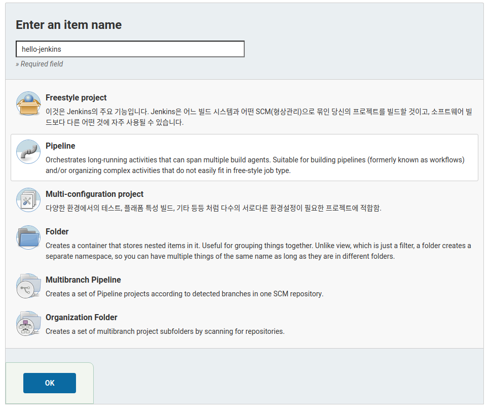

## 목표
- git repository 의 특정 브랜치에 소스가 push 되면, git repository 의 webhook 설정에 의해 jenkins 의 아이템을 실행한다.
- item 은 pipeLine 으로 구성하고, Jenkinsfile 을 작성하여 빌드 및 배포 구성을 코드로 관리한다.
- 빌드 구성
  - gradlew clean build
  - build 결과물을 바탕으로 Dockerfile build
  - docker compose 로  n 개의 springBoot app, maria-db container 를 실행
  - slack 으로 배포 결과 알림
- 포스팅에 사용한 저장소: [https://github.com/bingbingpa/spring-boot-with-docker](https://github.com/bingbingpa/spring-boot-with-docker)

### 1. 젠킨스 설치

- 저장소 키 다운로드
~~~ shell
wget -q -O - https://pkg.jenkins.io/debian/jenkins.io.key | sudo apt-key add -
~~~
- sources.list 에 추가
~~~ shell
echo deb http://pkg.jenkins.io/debian-stable binary/ | sudo tee /etc/apt/sources.list.d/jenkins.list
~~~
- 젠킨스 설치
~~~ shell
sudo apt-get update && install jenkins
~~~
- 초기 설치시 기본 포트는 8080 이며, 필요하다면 변경해주도록 한다.
~~~ shell
sudo vi /etc/default/jenkins
~~~

- 젠킨스의 pipeline 으로 docker 를 실행하기 위해 권한을 부여한다.
- /usr/bin/docker 의 사용자그룹을 jenkins 에 추가해준다.
~~~ shell
sudo usermod -aG root jenkins
~~~
- 서비스를 재시작하고 잘 기동 되었는지 확인한다.
~~~ shell
sudo systemctl restart jenkins
sudo systemctl status jenkins
~~~
- localhost:8091 로 접속 후 /var/lib/jenkins/ 경로의 secrets 폴더에서 initialAdminPassword 의 내용을 확인해서 입력한다.

- install suggested plugins 를 선택해서 추천 설정으로 설치한다.

- 설치가 끝나면 적절한 계정을 생성하고, url 에 별도의 컨텍스트가 필요하다면 추가한다.

 

### 2. 젠킨스 아이템 설정

- repository 에 Jenkinsfile 추가하기
  - 젠킨스 pipeline 에서 사용할 Jenkinsfile 을 프로젝트의 루트 경로에 다음과 같이 작성하고 커밋 & 푸쉬
  - ~~~ shell
          pipeline {
              agent any
              stages {
                  stage('test') {
                      steps {
                          script {
                              sh 'echo test'
                          }
                      }
                  }
              }
          }
      ~~~
- github token 생성하기
  - jenkins 에서 github repository 인증을 위해 사용할 token 을 생성한다.
  - settings - Developer settings - Personal access tokens - Generate new token 선택해서 토큰 생성
  - repo, admin:repo_hook 만 체크하고 생성한다.
  
- 젠킨스 아이템 설정
  - 메인 화면 좌측 메뉴에서 새로운 Item 선택
  - item 이름을 입력하고 Pipeline 을 선택 후에  OK
  
  - Build Triggers - GitHub hook trigger for GITScm polling 선택
  - 파이프 라인을 아래와 같이 설정한다.
    - Repository URL 은 위에서 사용한 저장소 url 을 입력한다.
    - branch 는 실제 github 저장소에 push 되었을 때 배포가 이루어질 branch 를 선택한다.
    - Script Path 는 github 저장소의 Jenkinsfile 의 경로를 적어준다.
    
    - Credentials Add 를 눌러 새로운 Credentials 를 등록하고 선택한다.
      - Username 은 자유롭게 입력
      - Password 에 위에서 생성한 github token 을 입력한다.
      
  - Credentials 정보를 선택해주고 저장한다.
  - 등록한 아이템을 실행해 본다.
  
  - 메인 좌측메뉴의 빌드기록에서 콘솔 버튼 선택
  
  - Jenkins 파일이 정상적으로 동작하는지 확인해 본다.
  

 

### 3. github webhook 설정

- repository 에 푸쉬가 발생했을 경우 젠킨스에 알려주기 위한 webhook 을 설정한다.
- 젠킨스에서 등록한 아이템의 github 저장소에서 Settings - Webhooks - Add webhook 선택
  - Payload URL 에 젠킨스 서버의 url 을 적어줘야 하는데, localhost 가 아닌 외부에서 접근할 수 있는 도메인이 필요하다.
  - 여기서는 테스트를 위해 ngrok([ngrok으로 로컬 네트워크의 터널 열기 참조](https://blog.outsider.ne.kr/1159)) 으로 외부 도메인을 바인딩한다.
  - 공식사이트에서 실행 파일을 다운받고 콘솔에서 다음과 같이 사용할 포트를 입력해준다.
  - ~~~ shell
    ./ngrok http 8091
    ~~~
  
  - 커맨드 실행 후 Forwarding 도메인을 등록한다.
    - **도메인 뒤에 꼭 /github-webhook/ 붙어야 한다. 마지막에 / 도 꼭 필요하다.**
    
  - item 으로 등록한 브랜치에 푸쉬 하고 정상적으로 item 이 실행되는지 확인한다.
  - Recent Deliveries 탭을 선택해서 실행된 webhook 들의 상태를 확인 할 수 있다.
  

 

### 4. slack 연동

- 설정할 slack 워크스페이스 url/apps 로 접속해서 jenkins 를 검색 후 설치할 채널을 선택하고 설치한다.
  
- Jenkins CI 통합 앱 추가 버튼 선택 시 나오는 설정 지침의 **3 단계에서 팀 하위 도메인(Team Domain), 통합 토큰 자격 증명 ID(Integration Token) 를 별도로 복사해둔다.**(젠킨스 설정에 사용)
- 젠킨스에서 젠킨스 관리 - 플러그인 관리 - 설치 가능 페이지에서 slack 을 검색해서 설치한다.
  
- 메인 페이지의 젠킨스 관리 - 시스템 설정으로 이동
- Slack 메뉴에서 slack 에서 복사한 팀 하위 도메인, 통합 토큰을 입력한다.
  - Workspace 에는 팀 하위 도메인 입력
  - Default channel / member id 는 slack 웹사이트 상에서 선택한 jenkins 알람을 받을 채널명
  
  - Credential
    - kind: Secret text
    - Secret: 통합 토큰 자격 증명
    - ID: 식별자이기 때문에 원하는 이름을 적는다.
      
- Test Connection 을 선택해서 성공하면 slack 채널에 다음과 같은 메시지가 나타난다.
  
- 젠킨스에서 일반적인 아이템으로 만들었을 경우에는 빌드 후 조치 메뉴에서 slack 알림 설정이 손쉽게 가능하지만 pipeline 을 선택할 경우에는 Jenkinsfile 에 별도로 작성해야 한다.
- 그런 불편함에도 pipeline 으로 아이템을 생성하는 이유는 Jenkinsfile 로 빌드 - 테스트 - 도커라이징 - 배포로 이어지는 과정을 Jenkinsfile 을 통해 코드로 관리 할 수 있기 때문이라고 생각한다.

 

### 5. Dockerfile 작성하기

- springBoot 2.3 부터 gradle 에서 bootBuildImage 라는 task 로 Dockerfile 없이 docker image 생성이 가능하다.
  - 하지만 docker image 의 이름을 변경하는 것 정도의 설정 말고는 별도의 custom 이 불가능하다.
- 별도의 Dockerfile 들을 작성하는 이유
  - docker-compose 로 db, springBoot app 모든 것들을 한번에 띄우려고 했지만 db container 가 뜨기 전에 springBoot app 이 실행 되면서 db connection 이 되지 않는 문제 발생.
  - 위의 문제를 해결하기 위해 dockerize 로 db container 가 실행 된 후 실행하려 했지만 bootBuildImage 로 만든 이미지는 커스텀 설정이 불가능한 것 같다.
- Dockerfile 에 넣기 위해 build.gradle 설정하기
  - build 할 때 lib 부분과 application 부분을 분리해서 빌드한다.
    - ~~~ properties
      //라이브러리 디렉토리 분리
      task moveLib {
          doLast {
              def unpackDir = "$buildDir/unpack"
              copy {
                  from file("${unpackDir}/app/BOOT-INF/lib")
                  into file("${unpackDir}/lib")
              }
          }
      }
      //jar 파일을 복사해서 unpack/app 디렉토리로 이동
      task unpackJar(type: Copy) {
          def unpackDir = "$buildDir/unpack"

              delete unpackDir
              from zipTree(bootJar.getArchiveFile())
              into "$unpackDir/app"

              finalizedBy moveLib
         }

        build {
            finalizedBy unpackJar
        }
      ~~~
- docker image 만들기
  - 하나의 Dockerfile 로 태그명과 copy 하는 데이터만 다르게 해서 springBoot app 들의 이미지를 만들 수도 있을거 같은데.. 각 서비스에서 별도의 설정이 필요할까봐 일단 각각의 서비스별로 Dockerfile 작성
  - ~~~ dockerfile
      FROM openjdk:11-jre-slim

      ENV DOCKERIZE_VERSION v0.6.1
      ENV DB_CONTAINER_NAME db

      RUN apt-get update -y && apt-get install -y wget && \
      wget https://github.com/jwilder/dockerize/releases/download/$DOCKERIZE_VERSION/dockerize-alpine-linux-amd64-$DOCKERIZE_VERSION.tar.gz \
      && tar -C /usr/local/bin -xzvf dockerize-alpine-linux-amd64-$DOCKERIZE_VERSION.tar.gz \
      && rm dockerize-alpine-linux-amd64-$DOCKERIZE_VERSION.tar.gz

      WORKDIR /root

      ARG buildDir=build/unpack

      COPY ${buildDir}/lib BOOT-INF/lib
      COPY ${buildDir}/app .

      CMD dockerize -wait tcp://$DB_CONTAINER_NAME:3306 -timeout 10s java -Dspring.profiles.active=${USER_PROFILE} org.springframework.boot.loader.JarLauncher
    ~~~
  - DB\_CONTAINER\_NAME: springBoot app 이 db container 보다 먼저 실행되는것을 막기 위해 CMD 에서 dockerize 명령으로 wait 할 db 컨테이너명을 적어준다.
  - USER_PROFILE: docker-compose 파일을 통해 환경변수로 받는 active profile 명이다.
  - COPY 를 2개로 분리하는 이유
      - Dockerfile 을 만드는 과정에서 레이어를  생성하는데 COPY 하나당 하나의 레이어가 생성된다.
      - 레이어는 도커 이미지를 만들 때 재사용이 가능한데 이렇게 app 영역과 lib 영역을 나누면 도커 이미지를 만드는 과정에서 캐시된 레이어를 재사용 할 수 있다.
  - Dockerfile 작성 순서
      - Dockerfile 을 위와 같은 순서로 작성한 이유는 일단 한 번 캐싱을 사용할 수 없는 구간이 발생하면, in order 로 진행되는 Docker 의 빌드 특성상 그 아래 모든 레이어는 캐싱을 사용할 수 없기 때문이다.
      - 만약 dockerize 를 다운받는 RUN 구문이 COPY 다음에 있고, 소스 코드의 변경이 발생한다면 COPY ${buildDir}/app . 부분에서 변경이 발생해서 캐시된 레이어를 사용하지 않고, 그 다음 RUN 구문에서도 캐시를
    사용하지 않게 된다.

 

### 6. docker-compose file 작성하기

- docker-compose file 은 로컬 개발환경용과 배포할 개발서버용을 따로 만들어서 사용했다. 로컬에서는 db, flyway 등 개발에 필요한 환경 구성용이고,
개발환경용은 개발에 필요한 환경과 springBoot app 을 컨테이너로 실행하는 환경까지 포함하고 있다.
- .env
  - docker-compose 파일에서 사용할 환경변수 목록
~~~ shell
  USER_PROFILE_DEVELOP=dev
  USER_PROFILE_PRODUCT=prod
~~~
- docker-compose-dev.yml
~~~ yaml
  version: '3'

  services:
    db:
      container_name: maria-db
      image: mariadb:10.6.4
      environment:
        - MARIADB_DATABASE=spring
        - MARIADB_ALLOW_EMPTY_ROOT_PASSWORD=yes
        - TZ=Asia/Seoul
        - LANG=C.UTF-8
      command: --character-set-server=utf8mb4 --collation-server=utf8mb4_unicode_ci
      ports:
        - "3306:3306"
    migration:
      image: flyway/flyway:8.0.4
      command: -configFiles=/flyway/conf/flyway.config -connectRetries=60 migrate
      volumes:
        - ./flyway/migration/main:/flyway/main
        - ./flyway/conf/develop.conf:/flyway/conf/flyway.config
      depends_on:
        - db
    admin:
      container_name: app-admin
      build: ./admin
      image: app-admin
      environment:
        - USER_PROFILE=${USER_PROFILE_DEVELOP}
      depends_on:
        - db
      ports:
        - "9090:8080"
    user:
      container_name: app-user
      build: ./user
      image: app-user
      environment:
        - USER_PROFILE=${USER_PROFILE_DEVELOP}
      depends_on:
        - db
      ports:
        - "8081:8080"
~~~
- flyway 설정
  - 로컬 개발환경에서는 버전관리하는 스크립트와 반복적으로 실행될 seed 를 모두 migration 해주고, 개발 환경에서는 버전관리용 스크립트만 실행하도록 했다.
  - 위의 docker-compose-dev 파일에서는 별도로 분리한 conf 파일중 develop.conf 파일을 사용하도록 했다.
  - 로컬(local.conf)
    - ~~~shell
      flyway.url=jdbc:mariadb://db:3306/spring
      flyway.user=root
      flyway.password=
      flyway.locations=filesystem:/flyway/main,filesystem:/flyway/seed
      ~~~
  - 개발환경(develop.conf)
    - ~~~shell
      flyway.url=jdbc:mariadb://db:3306/spring
      flyway.user=root
      flyway.password=
      flyway.locations=filesystem:/flyway/main
      ~~~
- springBoot profile 설정
  - 개발환경에서는 db 와 springBoot app 이 docker compose 로 같이 실행되면서 같은 네트워크를 사용하게 된다. 이때 **springBoot app 에서는 db connection 을 localhost 가 아닌
  db 의 서비스명을 적어줘야 한다.**
  - 그래서 다음과 같이 local 과 dev 환경의 profile 을 분리했다.
  - local
   ~~~ yaml
     spring:
       profiles:
         group:
           "dev" : "dev"
       datasource:
         driver-class-name: org.mariadb.jdbc.Driver
         url: jdbc:mariadb://localhost:3306/spring
         username: root
         password:
         hikari:
           maximum-pool-size: 5
           minimum-idle: 3
   ~~~
  - dev
   ~~~ yaml
     spring:
       datasource:
         driver-class-name: org.mariadb.jdbc.Driver
         url: jdbc:mariadb://db:3306/spring
         username: root
         password:
         hikari:
           maximum-pool-size: 5
           minimum-idle: 3
   ~~~

- 로컬에서 build & docker-compose 실행
  - Jenkinsfile 을 작성하기전에 로컬에서 docker-compose file 이 잘 실행되는지 테스트 한다.(프로젝트 root 경로에서 실행)
  - window 환경이라면 ./gradlew 가 아니라 gradlew.bat 파일로 실행해야 한다.
  ~~~ shell
  docker-compose -f docker-compose-dev.yml up -d db migration
  ./gradlew clean build
  docker-compose -f docker-compose-dev.yml build
  docker-compose -f docker-compose-dev.yml up -d
  ~~~

 

### 7. Jenkinsfile 작성하기

- 젠킨스의 빌드 기록의 빌드 목록중에서 화살표를 눌러 Replay 를 선택해서 아래의 스크립트를 넣어서 실행시켜 본다.

~~~ shell
pipeline {
    agent any
    stages {
        stage('Gradle test') {
            steps {
                script {
                    try {
                        sh 'chmod 755 ./gradlew'
                        sh 'docker-compose -f docker-compose-dev.yml down'
                        sh 'docker-compose -f docker-compose-dev.yml up -d db migration'
                        sh './gradlew clean build'
                    } catch (e) {
                        sh 'echo Gradle test Fail!!!'
                        slackSend (channel: '#jenkins-test', color: '#FF0000', message: "FAILED: Job '${env.JOB_NAME} [${env.BUILD_NUMBER}]' (${env.BUILD_URL})")
                    }
                }
            }
        }
        stage('Dockerfile build') {
            steps {
                script {
                    try {
                        sh 'docker-compose -f docker-compose-dev.yml build'
                    } catch (e) {
                        sh 'echo Dockerfile build Fail!!!'
                        slackSend (channel: '#jenkins-test', color: '#FF0000', message: "FAILED: Job '${env.JOB_NAME} [${env.BUILD_NUMBER}]' (${env.BUILD_URL})")
                    }
                }
            }
        }
        stage('Docker-compose') {
            steps {
                script {
                    try {
                        sh 'docker-compose -f docker-compose-dev.yml up -d'
                        slackSend (channel: '#jenkins-test', color: '#00FF00', message: "SUCCESSFUL: Job '${env.JOB_NAME} [${env.BUILD_NUMBER}]' (${env.BUILD_URL})")
                    } catch (e) {
                        sh 'echo Docker-compose Fail!!!'
                        slackSend (channel: '#jenkins-test', color: '#FF0000', message: "FAILED: Job '${env.JOB_NAME} [${env.BUILD_NUMBER}]' (${env.BUILD_URL})")
                    }
                }
            }
        }
    }
}
~~~
- 성공했다면 다음과 같은 메시지를 slack 에서 확인 할 수 있다.

 

### 8. 테스트

- 위에서 테스트에 성공한 스크립트를 github 저장소의 Jenkinsfile 에 추가해서 커밋 & 푸쉬한다.
- repository webhook 확인

- jenkins 빌드기록 확인

- slack 채널 메시지 확인
- docker-compose 파일에 설정한 springBoot app 이 정상적으로 실행되었는지 확인
  - http://localhost:9090/admin , http://localhost:8081/user 2개의 요청이 정상적인 값을 리턴하는지 확인

### TODO
- jenkins, slack, docker 를 이용해서 기본적인 빌드 & 배포 과정을 테스트 해보았지만 아래와 같은 것들을 더 공부해봐야 할 것 같다.
  - gradle build test 를 위한 별도의 db 컨테이너 사용하기
  - 서비스를 중단하지 않고, 무중단 배포하기
  - springBoot app 이 정상적으로 실행되었는지 Jenkinsfile 에서 확인후 slack 으로 알림
  - 배포가 실패할 경우 브랜치에 푸쉬한 사람을 특정해서 slack 또는 메일 알림 보내주기
  - docker build 후에 사용하지 않는 도커 레이어들을 정리하기
