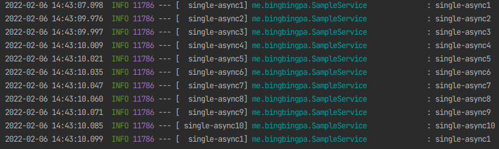
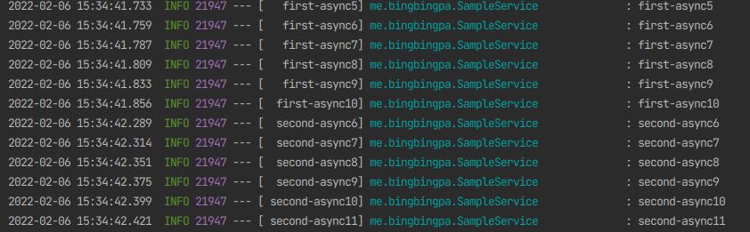
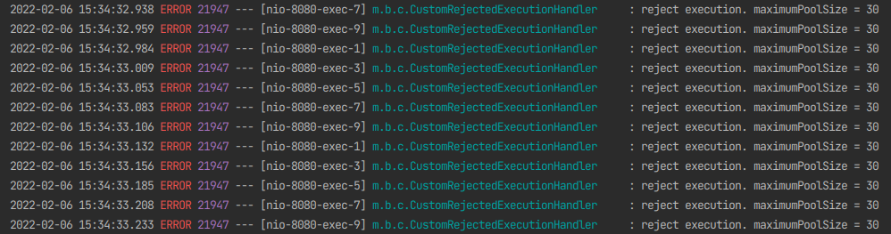
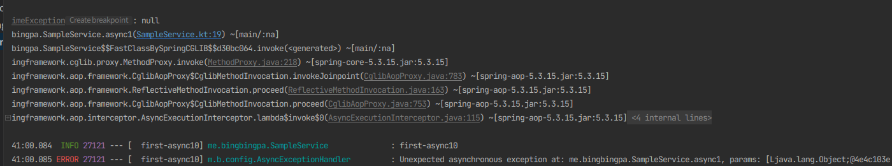

### @Async 기본으로 사용하기

- main 클래스에 @EnableAsync 추가해준다.
- 비동기로 처리하고자 하는 메소드에 @Async 를 붙여주면 끝!
- 문제점
  - @Async 의 기본설정인 SimpleAsyncTaskExecutor 를 사용한다.
  - 스레드가 제한 없이 계속 생성된다.
  - 제한이 없기 때문에 계속해서 스레드가 생성되고 서버에 부하를 주게 된다.
  - 그러다가 스레드가 가득 차서 언제 터질지 모른다...

### 커스터마이징

- 별도의 스레드풀을 만들고 관리할 필요가 있다.
- 스레드풀을 만드는 방법에는 ThreadPoolTaskExecutor 을 생성하는 Bean 을 등록하거나 AsyncConfigurerSupport 를 상속받는 클래스를 구현하는 방법이 있다.

#### 1) ThreadPoolTaskExecutor Bean 등록

- 옵션
  - corePoolSize: 최초 pool 개수
  - maxPoolSize: 최대 pool 개수
  - queueCapacity
      - default 값은 INTEGER.MAX_VALUE 이다.
      - Async 처리 Queue Size, maxPoolSize + queueCapacity 이상의 요청이 들어올 경우 TaskRejectedException 이 발생한다.
  - threadNamePrefix: 스레드 이름
- LinkedBlockingQueue 를 생성해서 core 사이즈만큼의 스레드에서 task 를 처리할 수 없을 경우 queue 에서 대기하게 된다.
- **queue 가 꽉 차게 되면 그때 max 사이즈만큼 스레드를 생성해서 처리하게 된다.**

~~~kotlin
@Configuration
@EnableAsync
class SingleAsyncConfig {

    @Bean
    fun singleAsync(): Executor {
        return ThreadPoolTaskExecutor().apply {
            corePoolSize = 10
            maxPoolSize = 50
            setQueueCapacity(1000)
            setThreadNamePrefix("single-async")
            initialize()
        }
    }
}
~~~

#### 2) AsyncConfigurerSupport 상속받는 클래스 구현

- 1번의 bean 을 등록하는 것과 큰 차이는 없지만 getAsyncUncaughtExceptionHandler() 를 오버라이드 해서 별도의 익셉션 핸들러를 등록할 수 있어서 이 방식이 더 좋다고 생각한다.
- 스레드풀을 여러개 등록할 때 기본으로 사용할 bean 에 @Primary 를 주면 @Async 에 이름을 주지 않으면 @Primary 가 있는 스레드풀을 사용하게 된다.
- 여기서는 AsyncExceptionHandler 와 CustomRejectedExecutionHandler 를 별도로 만들었는데 전자는 Async 메소드 내에서 익셉션이 발생했을 때에 대한 예외 처리이고,
후자는 스레드풀이 가득 찼을때에 대한 예외처리이다.
- multi async 설정
  ~~~kotlin
    @EnableAsync
    @Configuration
    class MultipleAsyncConfig : AsyncConfigurerSupport() {

        @Autowired
        lateinit var customRejectedExecutionHandler: CustomRejectedExecutionHandler
        @Autowired
        lateinit var asyncExceptionHandler: AsyncExceptionHandler

        @Primary
        @Bean("firstAsyncExecutor")
        override fun getAsyncExecutor(): Executor {
            return ThreadPoolTaskExecutor().apply {
                corePoolSize = 10
                maxPoolSize = 50
                setQueueCapacity(1000)
                setThreadNamePrefix("first-async")
                setRejectedExecutionHandler(customRejectedExecutionHandler)
                initialize()
            }
        }

        @Bean("secondAsyncExecutor")
        fun getSecondAsyncExecutor(): Executor {
            return ThreadPoolTaskExecutor().apply {
                corePoolSize = 5
                maxPoolSize = 30
                setQueueCapacity(100)
                setThreadNamePrefix("second-async")
                setRejectedExecutionHandler(customRejectedExecutionHandler)
                initialize()
            }
        }

        override fun getAsyncUncaughtExceptionHandler() = asyncExceptionHandler
    }

    @Component
    class CustomRejectedExecutionHandler : RejectedExecutionHandler {
        companion object {
            val logger: Logger = LoggerFactory.getLogger(CustomRejectedExecutionHandler::class.java.name)
        }

        override fun rejectedExecution(r: Runnable?, executor: ThreadPoolExecutor?) {
            logger.error("reject execution. maximumPoolSize = ${executor?.maximumPoolSize}")
        }
    }

    @Component
    class AsyncExceptionHandler : AsyncUncaughtExceptionHandler {
        companion object {
            val logger: Logger = LoggerFactory.getLogger(AsyncExceptionHandler::class.java.name)
        }

        override fun handleUncaughtException(ex: Throwable, method: Method, vararg params: Any?) {
            logger.error("Unexpected asynchronous exception at: ${method.declaringClass.name}.${method.name}, params: $params", ex)
        }
    }
  ~~~
- @Async 사용
  - 여기서는 각각의 스레드풀 크기를 다르게 하였고, 테스트를 위해 sleep 을 각각 3초, 10초로 주었다.
  - @Async 에 이름을 주지 않으면 @Primary 로 설정한 'first-async' 스레드풀을 사용하게 된다.
    ~~~kotlin
        @Service
        class SampleService {
            companion object {
                val logger: Logger = LoggerFactory.getLogger(SampleService::class.java.name)
            }

            @Async
            fun async1() {
                Thread.sleep(3000)
                logger.info(Thread.currentThread().name)
            }

            @Async("secondAsyncExecutor")
            fun async2() {
                Thread.sleep(10000)
                logger.info(Thread.currentThread().name)
            }
        }
    ~~~
- 테스트
  - 테스트에는 postman 을 이용하여 한번에 100 개 이상의 request 를 보내서 로그를 확인해 보았다.
  - 각각의 스레드풀이 수행되는 것을 확인할 수 있다.
    
  - 스레드풀이 가득 찼을 때 에러 핸들링
    
  - Async 메소드 내에서 발생한 에러 핸들링
    

- [사용한 샘플 코드](https://github.com/bingbingpa/blog-example/blob/main/spring-async-config/README.md)
