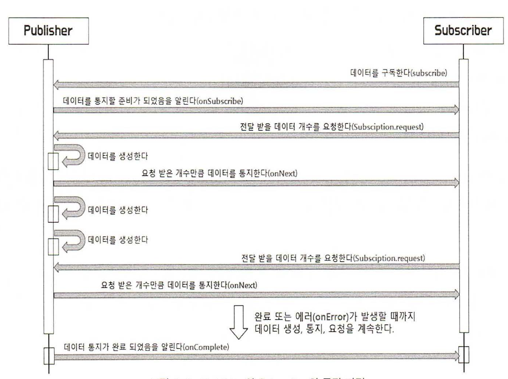
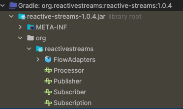
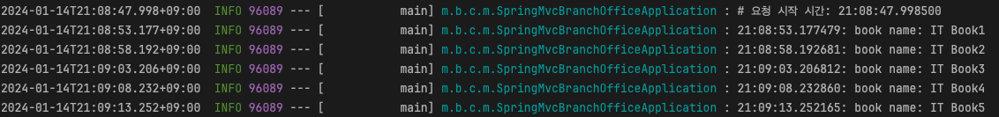
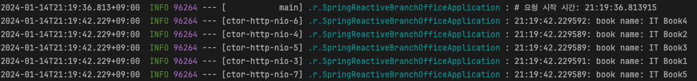

### 리액티브 시스템과 리액티브 프로그래밍
- `reactive` 의 사전적 의미에는 '반응을 하는'이라는 뜻이 있다. 즉, 어떤 이벤트나 상황이 발생했을 때, 반응을 해서 그에 따라 적절하게 행동하는 것을 의미한다.
- 리액티브 시스템은 **반응을 잘하는 시스템**이다. 다시 말해서 **클라이언트의 요청에 즉각적으로 응답함으로써 지연 시간을 최소화한다.**

### 리액티브 스트림즈(Reactive Streams)란?
- 데이터 스트림을 Non-Blocking 이면서 비동기적인 방식으로 처리하기 위한 리액티브 라이브러리의 표준 사양
- 리액티브 스트림즈를 구현한 구현체로 RxJava, Reactor, Akka Streams, Java 9 Flow API 등이 있다.
  - **RxJava** 의 Rx 는 Reactive Extensions 라는 의미이다. RxJava 는 .NET 환경의 리액티브 확장 라이브러리를 넷플릭스에서 Java 언어로 포팅하여 만든 JVM 기반의 대표적인 리액티브 확장 라이브러리이다.
  - **Reactor** 는 스프링팀에 의해 주도적으로 개발된 리액티브 스트림즈의 구현체
  - **Akka Streams** 는 JVM 상에서 동시성과 분산 애플리케이션을 단순화해 주는 오픈소스 툴킷
  - **Java 9 Flow API**
    - 다른 라이브러리처럼 리액티브 스트림즈를 구현한 구현체가 아니라 리액티브 표준 사양의 SPI(Service Provider Interface)로써 Java API 에 정의되어 있다.
      - 자바에서 사용되는 JDBC 를 예로들면 JDBC 는 사용자 입장에서는 API 가 되지만 JDBC 인터페이스를 구현해야 하는 벤더 입장에서 JDBC 는 SPI 가 된다.

### 리액티브 스트림즈 구성요소
 

| 컴포넌트          | 설명                                                                                                                       |
|---------------|--------------------------------------------------------------------------------------------------------------------------|
| Publisher     | 데이터를 생성하고 통지(발행, 게시, 방출)하는 역할                                                                                            |
| Subscriber    | 구독한 Publisher 로 부터 통지된 데이터를 전달받아서 처리하는 역할                                                                                |
| Subscription  | Publisher 에 요청할 데이터의 개수를 지정하고, 데이터의 구독을 취소하는 역할을 한다.                                                                     |
| Processor     | Publisher 와 Subscriber 의 기능을 모두 가지고 있다. 즉, Subscriber 로서 다른 Publisher 를 구독할 수 있고, Publisher 로서 다른 Subscriber 가 구독할 수 있다. |

 

- Publisher 와 Subscriber 의 동작 과정

- 리액티브 스트림즈는 다음과 같은 4개의 컴포넌트로 이루어져있다.

### Publisher
~~~java
public interface Publisher<T> {
    public void subscribe(Subscriber<? super T> s);
}
~~~
- subscribe 메서드는 파라미터로 전달받은 Subscriber 를 등록하는 역할을 한다.
- 개념상으로는 Subscriber 가 구독하는 것이 맞지만 실제 코드상에서는 위의 코드처럼 Publisher 가 subscribe 메서드의 파라미터인 Subscriber 를 등록하는 형태로 구독이 이루어진다.

### Subscriber
~~~java
public interface Subscriber<T> {
    public void onSubscribe(Subscription s);
    public void onNext(T t);
    public void onError(Throwable t);
    public void onComplete();
}
~~~
- **onSubscribe** 메서드는 구독 시작 시점에 어떤 처리를 하는 역할을 한다. 여기서의 처리는 Publisher 에게 요청할 데이터의 개수를 지정하거나 구독을
해지하는 것을 의미하고, 이것은 파라미터로 전달 되는 Subscription 객체를 통해서 이루어진다.
- **onNext** 메서드는 Publisher 가 통지한 데이터를 처리하는 역할을 한다.
- **onError** 메서드는 Publisher 가 데이터 통지를 위한 처리 과정에서 에러가 발생했을 때 해당 에러를 처리하는 역할을 한다.
- **onComplete** 메서드는 Publisher 가 데이터 통지를 완료했음을 알릴 때 호출되는 메서드이다. 데이터 통지가 정상적으로 완료될 경우에 어떤 후처리를
해야 한다면 이 메서드에서 처리 코드를 작성하면 된다.

### Subscription
~~~java
public interface Subscription {
    public void request(long n);
    public void cancel();
}
~~~
- Subscription 인터페이스는 Subscriber 가 구독한 데이터의 개수를 요청하거나 또는 데이터 요청의 취소, 즉 구독을 해지하는 역할을 한다.
- request 메서드를 통해서 Publisher 에게 데이터의 개수를 요청할 수 있고, cancel 메서드를 통해 구독을 해지할 수 있다.

### Processor
~~~java
public interface Processor<T, R> extends Subscriber<T>, Publisher<R> {
}
~~~
- Processor 의 경우 별도로 구현해야 하는 메소드가 없다. 다른 인터페이스와 다른 점은 Subscriber 인터페이스와 Publisher 인터페이스를 상속한다는 것이다.
이는 Processor 가 Publisher 와 Subscriber 의 기능을 모두 가지고 있기 때문이다.

### spring webMVC 와 webFlux 비교
- webMvc(Blocking I/O)
  - api 는 테스트를 위해 요청시 5초 딜레이를 주도록 설정

~~~kotlin
@RestController
@RequestMapping("/v1/books")
class SpringMvcBranchOfficeController(private val bookMap: Map<Long, Book>) {

    @ResponseStatus(HttpStatus.OK)
    @GetMapping("/{book-id}")
    @Throws(InterruptedException::class)
    fun getBook(@PathVariable("book-id") bookId: Long): ResponseEntity<Book> {
        // 테스트를 위해 5초 딜레이
        Thread.sleep(5000)

        val book: Book? = bookMap[bookId]

        return ResponseEntity.ok(book)
    }
}
~~~
  - 실행
    - 테스트를 위해 bookMap 이라는 임시 데이터를 생성하고 컨트롤러에 주입해주었다.
    - run 메소드를 통해 application 이 실행되면 5번의 api 요청을 한다.

~~~kotlin
@SpringBootApplication
class SpringMvcBranchOfficeApplication {
    @Bean
    fun bookMap(): Map<Long, Book> {
        val bookMap: MutableMap<Long, Book> = HashMap()
        for (i in 1L..2000000L) {
            bookMap[i] = Book(i, "IT Book$i", 2000)
        }

        return bookMap
    }

    @Bean
    fun restTemplate(): RestTemplateBuilder {
        return RestTemplateBuilder()
    }

    @Bean
    fun run() = CommandLineRunner {
        logger.info("# 요청 시작 시간: {}", LocalTime.now())
        for (i in 1..5) {
            val book = this.getBook(i.toLong())
            logger.info("{}: book name: {}", LocalTime.now(), book?.name)
        }
    }

    private fun getBook(bookId: Long): Book? {
        val restTemplate = RestTemplate()
        val baseUri = UriComponentsBuilder.newInstance().scheme("http")
            .host("localhost")
            .port(8080)
            .path("/v1/books")
            .build()
            .encode()
            .toUri()

        val getBooksUri = UriComponentsBuilder.fromUri(baseUri)
            .path("/{book-id}")
            .build()
            .expand(bookId)
            .encode()
            .toUri() // http://localhost:8080/v1/books/{book-id}

        val response =
            restTemplate.getForEntity(getBooksUri, Book::class.java)
        val book = response.body

        return book
    }

    companion object {
        @JvmStatic
        fun main(args: Array<String>) {
            SpringApplication.run(SpringMvcBranchOfficeApplication::class.java, *args)
        }
        private val logger by lazyLogger()
    }
}
~~~

- api 에서 5초의 딜레이를 주고 있고 동기 방식으로 호출되고 있기 때문에 모든 요청이 완료되는데는 약 25초정도가 소요된다.

- webFlux(Non-Blocking I/O)
  - 여기도 mvc 에서와 동일하게 5초의 딜레이를 준다.

~~~Kotlin
@RequestMapping("/v1/books")
@RestController
class SpringReactiveBranchOfficeController(private val bookMap: Map<Long, Book>) {

    @ResponseStatus(HttpStatus.OK)
    @GetMapping("/{book-id}")
    @Throws(InterruptedException::class)
    fun getBook(@PathVariable("book-id") bookId: Long): Mono<Book> {
        Thread.sleep(5000)

        val book: Book = bookMap[bookId] ?: throw RuntimeException("not found bookId = $bookId")

        return Mono.just(book)
    }
}
~~~

- 실행

~~~kotlin
@SpringBootApplication
class SpringReactiveBranchOfficeApplication {

    @Bean
    fun bookMap(): Map<Long, Book> {
        val bookMap: MutableMap<Long, Book> = HashMap()
        for (i in 1L..2000000L) {
            bookMap[i] = Book(i, "IT Book$i", 2000)
        }

        return bookMap
    }

    @Bean
    fun run() = CommandLineRunner {
        logger.info("# 요청 시작 시간: {}", LocalTime.now())
        for (i in 1..5) {
            getBook(i.toLong()).subscribe { book ->
                logger.info("{}: book name: {}", LocalTime.now(), book.name)
            }
        }
    }

    private fun getBook(bookId: Long): Mono<Book> {
        val baseUri = UriComponentsBuilder.newInstance().scheme("http")
            .host("localhost")
            .port(8080)
            .path("/v1/books")
            .build()
            .encode()
            .toUri()
        val getBooksUri = UriComponentsBuilder.fromUri(baseUri)
            .path("/{book-id}")
            .build()
            .expand(bookId)
            .encode()
            .toUri() // http://localhost:8080/v1/books/{book-id}

        return WebClient.create()
            .get()
            .uri(getBooksUri)
            .retrieve()
            .bodyToMono(Book::class.java)
    }

    companion object {
        @JvmStatic
        fun main(args: Array<String>) {
            SpringApplication.run(SpringReactiveBranchOfficeApplication::class.java, *args)
        }
        private val logger by lazyLogger()
    }
}
~~~

- webFlux 는 비동기 방식으로 동작하기 때문에 약 5초안에 모든 요청이 완료된다.
- webMvc 의 로그를 보면 모두 main 스레드에서 수행되지만 webFlux 에서는 각각의 다른 스레드에서 로그가 찍히는걸 볼 수 있다.
이 부분은 책을 조금 더 공부하면서 정리해보도록 해야겠다.

# Blocking I/O 와 Non-Blocking I/O 의 특징
- Blocking I/O
  - 작업 스레드의 작업이 종료될 때까지 요청 스레드가 차단된다.
  - 스레드가 차단되는 문제를 보완하기 위해 멀티스레딩 기법을 사용할 수 있다.
  - 멀티스레딩 기법 사용 시 컨텍스트 스위칭 전환 비용, 메모리 사용 오버헤드, 스레드 풀의 응답 지연 등의 문제가 발생할 수있다.
- Non-Blocking I/O
  - 작업 스레드의 종료 여부와 상관없이 요청 스레드가 차단되지 않는다.
  - 적은 수의 스레드만 사용해 스레드 전환 비용이 적으므로, CPU 를 효율적으로 사용할 수 있다.
  - **CPU 를 많이 사용하는 작업의 경우에는 성능에 악영향을 미칠 수 있다.**
  - 사용자 요청 처리에서 응답까지 전 과정이 Non-Blocking 이어야 제대로 된 효과를 얻을 수 있다.
    - webFlux 사용한다고 하고 .block() 으로 동기식으로 처리하면 그냥 webMvc 쓰는게 나을 것 같다는 생각이 든다.
    - 하지만 .block() 을 어쩔 수 없이 사용했던 경우가 있었는데 클라이언트에서 api 요청 후 동기식으로 기다리는 경우 클라이언트의 요청이 끊기게 되면 api 요청이 cancel 되는 경우가 있어서
    block 을 사용했던 적이 있다. 클라이언트까지 비동기로 처리를 해야 책에 있는 것처럼 제대로 된 효과를 얻을 수 있을 것 같다고 생각한다.

- Reference
  - 스프링으로 시작하는 리액티브 프로그래밍
- [사용한 샘플 코드](https://github.com/bingbingpa/dev-book/tree/main/spring-reactive/src/main/kotlin/me/bingbingpa/ch03)
