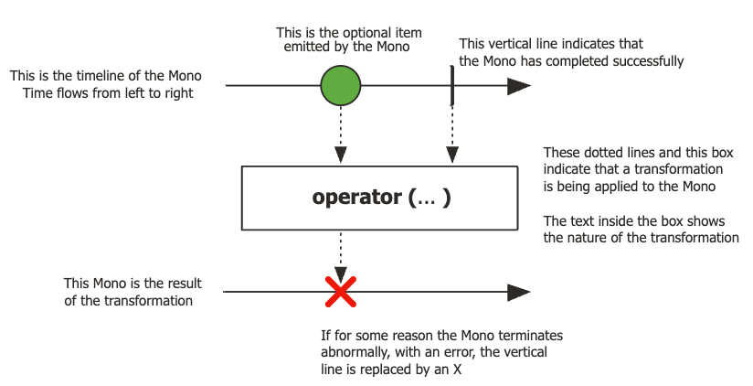
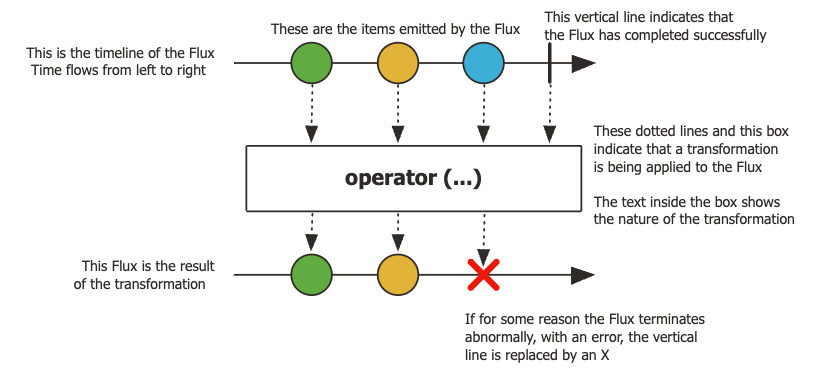
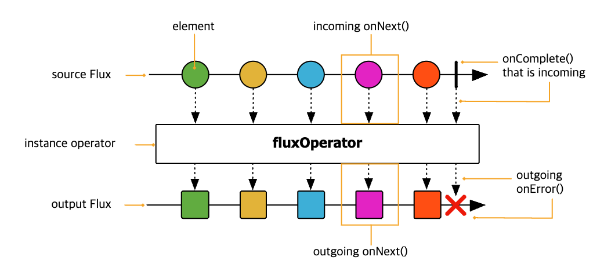
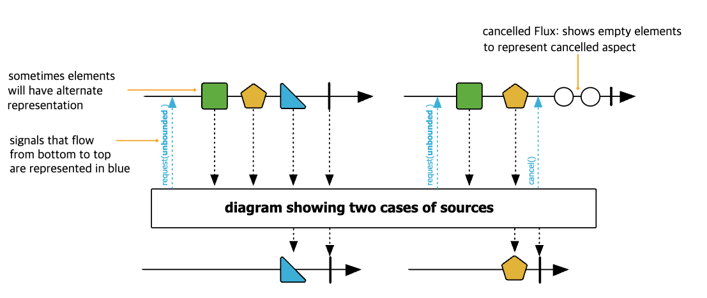

# 📘 스프링으로 시작하는 리액티브 프로그래밍 챕터 5~6

 

### Reactor 특징

- 리액티브 스트림즈의 구현체인 `Reactor` 는 리액티브 프로그래밍을 위한 라이브러리이며,
Reactor Core 라이브러리는 Spring WebFlux 프레임워크 라이브러리로 포함되어 있다.
- Mono[0|1]
  
  - Mono 는 데이터를 한 건도 emit 하지 않거나 단 한건만 emit 하는 단발성 데이터 emit 에 특화된 Publisher 이다.
- Flux[N]
  
  - Flux[N] 이라는 의미는 N 개의 데이터를 emit 한다는 것인데, 다시 말해서 Flux 는 0 개부터 N개, 즉 무한대의 데이터를 emit 할 수 있는
  Reactor 의 Publisher 이다.
  - Publisher 가 Subscriber 에게 데이터를 전달하는 것을 일컬을 때 데이터를 '통지(발행, 게시, 방출)한다'라고 하는데 이런 용어들의 공통점은
  입력으로 들어오는 데이터를 제공한다라는 의미이다.
- Backpressure-ready network
  - Reactor 는 Publisher 로부터 전달 받은 데이터를 처리하는 데 있어 과부하가 걸리지 않도록 제어하는
  Backpressure 를 지원한다.
  - 우리말로는 '배압'이라고 하는데 가스나 액체 등의 흐름을 제어하기 위해 역으로 가해지는 압력을 의미한다.
  - 비슷한 맥락으로 Publisher 로부터 전달되는 대량의 데이터를 Subscriber 가 적절하게 처리하기 위한 제어 방법이 바로 Backpressure 이다.

### Mono\<List\<T>> 와 Flux\<T> 의 차이점은?
- Mono 와 Flux 에 대해 처음 접했을 때 Flux 는 N 개의 데이터를 받을 수 있고, Mono\<List\<T>> 로 리스트로 여러건의
데이터를 받을 수 있으니까 같은게 아닌가? 라는 생각이 들었다.
- Flux 는 각 데이터 항목을 개별적으로 처리하는 반면 Mono\<List\<T>> 는 리스트 전체를 단일 데이터 항목으로 처리한다. 이는 Flux 에서는 각 항목에
대한 처리가 병렬적이거나 비동기적으로 이루어질 수 있지만, Mono\<List\<T>> 에서는 리스트 전체에 대한 처리가 한 번에 이루어진다는 것을 의미한다.
- Flux 는 backpressure 를 관리하는데, 이는 subscriber 가 처리할 수 있는 속도에 맞춰 데이터를 제공하는 것을 의미한다. 하지만 Mono\<List\<T>>
는 리스트 전체에 대한 처리가 한 번에 이루어진다.
- Flux 는 여러 데이터 항목에 대해 여러 개의 onNext 시그널을 발생시키고, 마지막에 onComplete 혹은 onError 시그널을 발생시킨다. 반면 Mono\<List\<T>>
는 단일 데이터 항목(List\<T>)에 대해서만 onNext 시그널을 발생시키고, 마지막에 onComplete 또는 onError 시그널을 발생시킨다.
- 이 내용을 정리하면 다음과 같다.
  - Flux 는 데이터 스트림을 통해 개별적이고 연속적인 데이터 처리를 제공하는 반면, Mono\<List\<T>> 는 단일 단위로 전체 데이터 세트를 처리한다.
  - **Flux 는 T 타입의 데이터가 각각 발행되고, Subscriber 가 이를 받을 수 있고, Mono\<List\<T>> 는 List\<T> 가 모두 준비되어야지만
  이를 발행하고 Subscriber 가 받을 수 있다.**

### Hello Reactor 코드로 보는 Reactor 의 구성요소
~~~kotlin
fun main() {
    Flux.just("Hello", "Reactor")
        .map { it.lowercase(Locale.getDefault()) }
        .subscribe(::println)
}
~~~
- Flux 는 Reactor 에서 Publisher 의 역할을 한다. 예제에서 Flux 대신 Mono 를 사용할 수도 있고, 이때는 하나의 데이터만을 Mono.just() 로
Publish 할 수도 있다.
- subscribe 메서드의 파라미터로 전달된 메소드 참조인 ::println 이 Subscriber 역할을 한다.
- just, map 은 Reactor 에서 지원하는 Operator 메서드인데, just() 는 데이터를 생성해서 제공하는 역할, map() 은 전달받은 데이터를
가공하는 역할을 한다.
- 크게 보면 **데이터를 생성해서 제공하고(1단계), 데이터를 가공한 후에(2단계) 전달받은 데이터를 처리한다(3단계)는 3단계를 거친다.**

### 마블 다이어그램(Marble Diagram)

- 마블은 우리말로 구슬이라는 의미가 있고, 다이어그램은 여러 가지 도형들로 그려진 도표를 뜻한다. 즉, 여러 가지 구슬 모양의 도형으로 구성된 도표로,
비동기적인 데이터 흐름을 시간의 흐름에 따라 시각적으로 표시한 다이어그램이다.
- 근데 처음 마블 다이어그램을 보면 이게 뭔가 싶다. 오히려 이것 때문에
Reactor 에 접근하기가 더 어렵지 않나 개인적으로 생각한다. 그렇지만 Operator 를 올바르게 이해하고 사용하기 위해 꼭 필요한 부분이다.

- 마블 다이어그램은 크게 두 개의 타임라인과 Operator 로 구성되어 있다.
- 상단의 타임라인은 Publisher 가 데이터를 emit 하는 타임라인이고, 왼쪽에서 오른쪽으로 시간이 흐르는 것을 의미하기 때문에
가장 왼쪽에 있는 구슬이 시간상으로 가장 먼저 emit 된 데이터이다.
- 가운데 박스는 Publisher 로부터 전달받은 데이터를 처리하는 Operator 함수이다. Operator 마다 다양한 마블 다이어그램을 가진다.
- 하단의 타임라인은 Operator 함수에서 가공 처리되어 출력으로 내보내진 타임라인이다.
- | 는 처리되는 요소들의 정상적인 완료를 의미한다.
- ❌ 표시는 에러가 발생해 데이터 처리가 종료되었음을 의미하며, onError Signal 에 해당된다.

- 이 마블 다이어그램은 정상적으로 데이터 방출이 완료된 경우와 중간에 cancel 된 경우를 보여준다.
- 왼쪽은 세개의 데이터중 하나의 데이터만 Operator 를 통과 하고 complete signal 이 방출된다는 것을 의미한다.
- 오른쪽은 두 번째 데이터가 들어오고, cancel 신호를 전달하는 경우를 보여준다. 이때 두 번째 데이터만 방출하고, 그 뒤의 데이터는 요청하지 않고
complete signal 이 방출된다는 것을 의미한다.

 

이 정도만 알고 있어도 대략적으로 마블 다이어그램을 읽고, 해당 오퍼레이터에 대해 이해 할 수 있다. 
이 외에 오퍼레이터와 그에 해당하는 마블 다이어그램들에 대해서는 14장에서 정리할 예정!

### Reference
- 스프링으로 시작하는 리액티브 프로그래밍
- [Reactor 제대로 이해하기, Marble Diagram](https://gngsn.tistory.com/226)
- [How to read marble diagrams?](https://projectreactor.io/docs/core/release/reference/#howtoReadMarbles)
- [Mono](https://projectreactor.io/docs/core/release/api/reactor/core/publisher/Mono.html#flatMap-java.util.function.Function)
- [Flux](https://projectreactor.io/docs/core/release/api/reactor/core/publisher/Flux.html#flatMap-java.util.function.Function)
- [Understanding Marble Diagrams for Reactive Streams](https://medium.com/@jshvarts/read-marble-diagrams-like-a-pro-3d72934d3ef5)
- [flatMap 만 사용하기는 그만! Reactor 오퍼레이터 파헤치기](https://d2.naver.com/helloworld/2771091)
