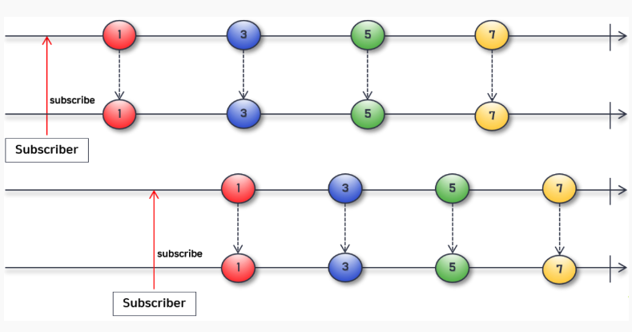
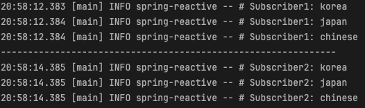
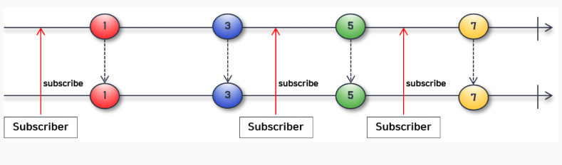

# 📘 스프링으로 시작하는 리액티브 프로그래밍 챕터 7

 

### Cold Sequence

- Subscriber 가 구독할 때마다 데이터 흐름이 처음부터 다시 시작되는 sequence 이다.
- 마블 다이어그램을 보면 위쪽에 위치한 Subscriber A 가 구독을 하면 Publisher 는 네 개의 데이터를 emit 한다. 그리고 아래쪽에 위치한 Subscriber B
가 구독을 해도 역시 네 개의 데이터를 emit 한다.
- A, B 의 구독 시점이 다르지만 모두 동일한 데이터를 전달받는다.
- 이처럼 Subscriber 의 구독 시점이 달라도 구독을 할 때마다 Publisher 가 데이터를 emit 하는 과정을 처음부터 다시 시작하는 데이터의 흐름을
Cold Sequence 라고 부른다.
- 예를 들면 현실 세계에서 오프라인으로 월간 잡지의 발행이 1월부터 시작되었고, 구독자가 5월부터 잡지를 구독했는데 1월달 잡지부터 모두 보내주는 경우와 같다고 할 수 있다.

~~~kotlin
fun main() {
    val coldFlux = Flux
        .fromIterable(listOf("KOREA", "JAPAN", "CHINESE"))
        .map(String::lowercase)

    coldFlux.subscribe { country -> logger.info("# Subscriber1: $country") }
    println("-------------------------")
    Thread.sleep(2000L)
    coldFlux.subscribe { country -> logger.info("# Subscriber2: $country") }
}
~~~

- 코드 실행 결과를 보면 구독이 발생할 때마다 emit 된 데이터를 처음부터 다시 전달받고 있음을 확인할 수 있다.

### Hot Sequence

- Cold Sequence 는 구독이 발생할 때마다 Sequence 의 타임라인이 처음부터 새로 시작하기 때문에 Subscriber 는 구독 시점과 상관없이
데이터를 처음부터 다시 전달받을 수 있다.
- 반면에 Hot Sequence 는 구독이 발생한 시점 이전에 Publisher 로부터 emit 된 데이터는 Subscriber 가 전달받지 못하고
구독이 발생한 시점 이후에 emit 된 데이터만 전달받을 수 있다.
- 마블 다이어그램을 보면 세 번의 구독이 발생했지만 타임라인은 하나밖에 생성되지 않은것을 볼 수 있다.
  - Hot sequence 는 구독이 아무리 많이 발생해도 Publisher 가 데이터를 처음부터 emit 하지 않는다.
- 예를 들면 현실 세계에서 오프라인으로 월간 잡지의 발행이 1월부터 시작되었고, 구독자가 5월부터 잡지를 구독했다면 1월달 잡지부터 모두 보내주는 것이 아니라
5월달 잡지부터 보내주는 경우와 같다고 할 수 있다.

~~~kotlin
fun main() {
    val singers = arrayOf("Singer A", "Singer B", "Singer C", "Singer D", "Singer E")
    logger.info("# Begin concert:")
    val concertFlux = Flux
        .fromArray(singers)
        .delayElements(Duration.ofSeconds(1)) // 데이터 소스로 입력된 각 데이터의 emit 을 일정시간 동안 지연시키는 오퍼레이터
        .share() // cold sequence 를 hot sequence 로 동작하게 해주는 오퍼레이터

    concertFlux.subscribe { singer -> logger.info("# Subscriber1 is watching ${singer}'s song") }

    Thread.sleep(2500L)

    concertFlux.subscribe { singer -> logger.info("# Subscriber2 is watching ${singer}'s song") }

    Thread.sleep(3000L)
}
~~~

- 코드 실행 결과를 보면 첫 번째 구독에서는 원본 Flux 에서 emit 한 데이터를 모두 전달받아서 출력하는 것을 볼 수 있다.
- 두 번째 구독의 경우, 원본 Flux 가 emit 한 데이터 중에서 Singer A, Singer B 는 전달받지 못하는 것을 확인할 수 있다.
  - sleep 2.5초 뒤에 두 번째 구독이 발생했기 때문에 2.5초의 지연 시간 동안 원본 Flux 가 이미 Singer A, Singer B 데이터를 emit 하기 때문이다.

 

- [사용한 샘플 코드](https://github.com/bingbingpa/dev-book/tree/main/spring-reactive/src/main/kotlin/me/bingbingpa/ch07)
